####Armory: Doom Style
|ID|Name|Preview|Comment|
|---|---|---|---|
|[342](https://github.com/alexey-lysiuk/Realm667-AAA-Cache/raw/master/data/0342.zip)|40mm Grenade Launcher|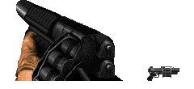||
|[585](https://github.com/alexey-lysiuk/Realm667-AAA-Cache/raw/master/data/0585.zip)|AA12 Shotgun|||
|[260](https://github.com/alexey-lysiuk/Realm667-AAA-Cache/raw/master/data/0260.zip)|Action MachineGun|||
|[516](https://github.com/alexey-lysiuk/Realm667-AAA-Cache/raw/master/data/0516.zip)|AK47|||
|[685](https://github.com/alexey-lysiuk/Realm667-AAA-Cache/raw/master/data/0685.zip)|Ammo Satchel|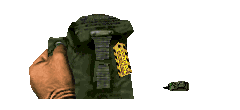||
|[534](https://github.com/alexey-lysiuk/Realm667-AAA-Cache/raw/master/data/0534.zip)|Angled Pistol|||
|[432](https://github.com/alexey-lysiuk/Realm667-AAA-Cache/raw/master/data/0432.zip)|Autogun|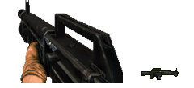||
|[884](https://github.com/alexey-lysiuk/Realm667-AAA-Cache/raw/master/data/0884.zip)|Axe|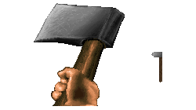||
|[874](https://github.com/alexey-lysiuk/Realm667-AAA-Cache/raw/master/data/0874.zip)|BFG 2704|||
|[372](https://github.com/alexey-lysiuk/Realm667-AAA-Cache/raw/master/data/0372.zip)|BFG10K|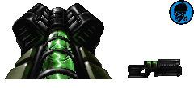||
|[281](https://github.com/alexey-lysiuk/Realm667-AAA-Cache/raw/master/data/0281.zip)|Bio Pipebomb Launcher|||
|[903](https://github.com/alexey-lysiuk/Realm667-AAA-Cache/raw/master/data/0903.zip)|Black Hole Generator|||
|[330](https://github.com/alexey-lysiuk/Realm667-AAA-Cache/raw/master/data/0330.zip)|Butcher (Gun)|||
|[403](https://github.com/alexey-lysiuk/Realm667-AAA-Cache/raw/master/data/0403.zip)|Channeler|||
|[758](https://github.com/alexey-lysiuk/Realm667-AAA-Cache/raw/master/data/0758.zip)|Claymore Mines|||
|[445](https://github.com/alexey-lysiuk/Realm667-AAA-Cache/raw/master/data/0445.zip)|Coachgun|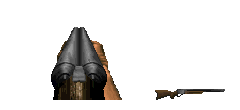||
|[581](https://github.com/alexey-lysiuk/Realm667-AAA-Cache/raw/master/data/0581.zip)|Colt 45|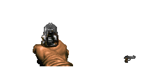||
|[816](https://github.com/alexey-lysiuk/Realm667-AAA-Cache/raw/master/data/0816.zip)|CryoBow|||
|[308](https://github.com/alexey-lysiuk/Realm667-AAA-Cache/raw/master/data/0308.zip)|Doom 3 SSG|||
|[520](https://github.com/alexey-lysiuk/Realm667-AAA-Cache/raw/master/data/0520.zip)|Double Bladed Chainsaw|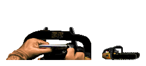||
|[344](https://github.com/alexey-lysiuk/Realm667-AAA-Cache/raw/master/data/0344.zip)|Double Grenade Launcher|||
|[409](https://github.com/alexey-lysiuk/Realm667-AAA-Cache/raw/master/data/0409.zip)|Duke Shotgun|||
|[246](https://github.com/alexey-lysiuk/Realm667-AAA-Cache/raw/master/data/0246.zip)|Ego Smasher|||
|[262](https://github.com/alexey-lysiuk/Realm667-AAA-Cache/raw/master/data/0262.zip)|Electro Gun|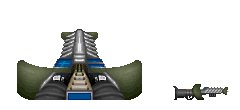||
|[507](https://github.com/alexey-lysiuk/Realm667-AAA-Cache/raw/master/data/0507.zip)|Fist Redux|||
|[541](https://github.com/alexey-lysiuk/Realm667-AAA-Cache/raw/master/data/0541.zip)|Flamethrower|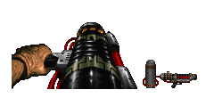||
|[913](https://github.com/alexey-lysiuk/Realm667-AAA-Cache/raw/master/data/0913.zip)|Flashlight|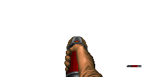||
|[242](https://github.com/alexey-lysiuk/Realm667-AAA-Cache/raw/master/data/0242.zip)|Freeze Rifle|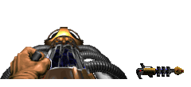||
|[559](https://github.com/alexey-lysiuk/Realm667-AAA-Cache/raw/master/data/0559.zip)|Glock 18|||
|[373](https://github.com/alexey-lysiuk/Realm667-AAA-Cache/raw/master/data/0373.zip)|Grenade Launcher|||
|[406](https://github.com/alexey-lysiuk/Realm667-AAA-Cache/raw/master/data/0406.zip)|Grenade Launcher (KDiZD)|.png)||
|[254](https://github.com/alexey-lysiuk/Realm667-AAA-Cache/raw/master/data/0254.zip)|HandGrenade|||
|[760](https://github.com/alexey-lysiuk/Realm667-AAA-Cache/raw/master/data/0760.zip)|Heavy Chaingun|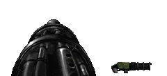||
|[803](https://github.com/alexey-lysiuk/Realm667-AAA-Cache/raw/master/data/0803.zip)|Heavy Machinegun|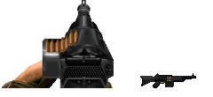||
|[255](https://github.com/alexey-lysiuk/Realm667-AAA-Cache/raw/master/data/0255.zip)|Heavy Rifle|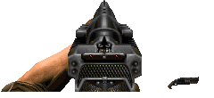||
|[508](https://github.com/alexey-lysiuk/Realm667-AAA-Cache/raw/master/data/0508.zip)|Hellstorm Cannon|||
|[719](https://github.com/alexey-lysiuk/Realm667-AAA-Cache/raw/master/data/0719.zip)|Hunting Rifle|||
|[315](https://github.com/alexey-lysiuk/Realm667-AAA-Cache/raw/master/data/0315.zip)|iGun|||
|[381](https://github.com/alexey-lysiuk/Realm667-AAA-Cache/raw/master/data/0381.zip)|Ionspray|||
|[239](https://github.com/alexey-lysiuk/Realm667-AAA-Cache/raw/master/data/0239.zip)|Karasawa|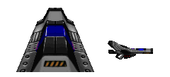||
|[247](https://github.com/alexey-lysiuk/Realm667-AAA-Cache/raw/master/data/0247.zip)|Knife|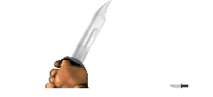||
|[717](https://github.com/alexey-lysiuk/Realm667-AAA-Cache/raw/master/data/0717.zip)|Landmine Layer|||
|[804](https://github.com/alexey-lysiuk/Realm667-AAA-Cache/raw/master/data/0804.zip)|Light Machinegun|||
|[514](https://github.com/alexey-lysiuk/Realm667-AAA-Cache/raw/master/data/0514.zip)|M16|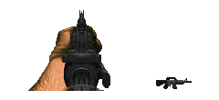||
|[600](https://github.com/alexey-lysiuk/Realm667-AAA-Cache/raw/master/data/0600.zip)|M40A1 Sniper Rifle|||
|[598](https://github.com/alexey-lysiuk/Realm667-AAA-Cache/raw/master/data/0598.zip)|M79|||
|[265](https://github.com/alexey-lysiuk/Realm667-AAA-Cache/raw/master/data/0265.zip)|Machete|||
|[233](https://github.com/alexey-lysiuk/Realm667-AAA-Cache/raw/master/data/0233.zip)|Machinegun|||
|[521](https://github.com/alexey-lysiuk/Realm667-AAA-Cache/raw/master/data/0521.zip)|Mag .60|||
|[256](https://github.com/alexey-lysiuk/Realm667-AAA-Cache/raw/master/data/0256.zip)|Mancubus Arm|||
|[761](https://github.com/alexey-lysiuk/Realm667-AAA-Cache/raw/master/data/0761.zip)|Micro Uzi|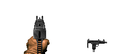||
|[225](https://github.com/alexey-lysiuk/Realm667-AAA-Cache/raw/master/data/0225.zip)|Minigun|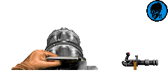||
|[762](https://github.com/alexey-lysiuk/Realm667-AAA-Cache/raw/master/data/0762.zip)|Model 1887|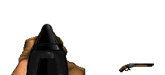||
|[599](https://github.com/alexey-lysiuk/Realm667-AAA-Cache/raw/master/data/0599.zip)|MP40|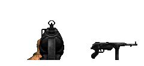||
|[684](https://github.com/alexey-lysiuk/Realm667-AAA-Cache/raw/master/data/0684.zip)|MP5|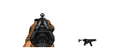||
|[496](https://github.com/alexey-lysiuk/Realm667-AAA-Cache/raw/master/data/0496.zip)|Nailgun (MG)|.png)||
|[560](https://github.com/alexey-lysiuk/Realm667-AAA-Cache/raw/master/data/0560.zip)|Nailgun (SG)|.png)||
|[268](https://github.com/alexey-lysiuk/Realm667-AAA-Cache/raw/master/data/0268.zip)|Nuclear Missile|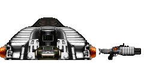||
|[245](https://github.com/alexey-lysiuk/Realm667-AAA-Cache/raw/master/data/0245.zip)|Pipe Bombs|||
|[232](https://github.com/alexey-lysiuk/Realm667-AAA-Cache/raw/master/data/0232.zip)|Plasma Beam|||
|[313](https://github.com/alexey-lysiuk/Realm667-AAA-Cache/raw/master/data/0313.zip)|Plasma Bolter|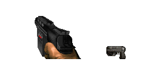||
|[763](https://github.com/alexey-lysiuk/Realm667-AAA-Cache/raw/master/data/0763.zip)|Plasma Pistol|||
|[329](https://github.com/alexey-lysiuk/Realm667-AAA-Cache/raw/master/data/0329.zip)|Plasma Shotgun|||
|[509](https://github.com/alexey-lysiuk/Realm667-AAA-Cache/raw/master/data/0509.zip)|Prox Launcher|||
|[764](https://github.com/alexey-lysiuk/Realm667-AAA-Cache/raw/master/data/0764.zip)|Pulse Nailgun|||
|[522](https://github.com/alexey-lysiuk/Realm667-AAA-Cache/raw/master/data/0522.zip)|Pulse Rifle|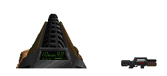||
|[659](https://github.com/alexey-lysiuk/Realm667-AAA-Cache/raw/master/data/0659.zip)|Pulse Rifle UAC|||
|[244](https://github.com/alexey-lysiuk/Realm667-AAA-Cache/raw/master/data/0244.zip)|Pump-Action Shotgun|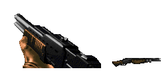||
|[374](https://github.com/alexey-lysiuk/Realm667-AAA-Cache/raw/master/data/0374.zip)|Railgun|||
|[718](https://github.com/alexey-lysiuk/Realm667-AAA-Cache/raw/master/data/0718.zip)|Raptor Handgun|||
|[523](https://github.com/alexey-lysiuk/Realm667-AAA-Cache/raw/master/data/0523.zip)|Ray Gun|||
|[561](https://github.com/alexey-lysiuk/Realm667-AAA-Cache/raw/master/data/0561.zip)|Reaper|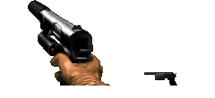||
|[567](https://github.com/alexey-lysiuk/Realm667-AAA-Cache/raw/master/data/0567.zip)|Repeater|||
|[407](https://github.com/alexey-lysiuk/Realm667-AAA-Cache/raw/master/data/0407.zip)|Rifle|||
|[857](https://github.com/alexey-lysiuk/Realm667-AAA-Cache/raw/master/data/0857.zip)|Rivet Gun|||
|[886](https://github.com/alexey-lysiuk/Realm667-AAA-Cache/raw/master/data/0886.zip)|Scatter Pistol|||
|[368](https://github.com/alexey-lysiuk/Realm667-AAA-Cache/raw/master/data/0368.zip)|Shield Gun|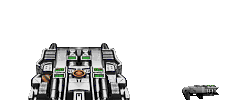||
|[601](https://github.com/alexey-lysiuk/Realm667-AAA-Cache/raw/master/data/0601.zip)|Side-By-Side Shotgun|||
|[512](https://github.com/alexey-lysiuk/Realm667-AAA-Cache/raw/master/data/0512.zip)|Silenced Pistol|||
|[259](https://github.com/alexey-lysiuk/Realm667-AAA-Cache/raw/master/data/0259.zip)|SmartGun|||
|[513](https://github.com/alexey-lysiuk/Realm667-AAA-Cache/raw/master/data/0513.zip)|Smasher|||
|[272](https://github.com/alexey-lysiuk/Realm667-AAA-Cache/raw/master/data/0272.zip)|Sniper Rifle|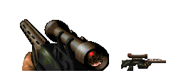||
|[250](https://github.com/alexey-lysiuk/Realm667-AAA-Cache/raw/master/data/0250.zip)|SPAS-12|||
|[876](https://github.com/alexey-lysiuk/Realm667-AAA-Cache/raw/master/data/0876.zip)|Spray Cannon|||
|[767](https://github.com/alexey-lysiuk/Realm667-AAA-Cache/raw/master/data/0767.zip)|Strife Pistol|||
|[568](https://github.com/alexey-lysiuk/Realm667-AAA-Cache/raw/master/data/0568.zip)|Stunner Rifle|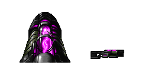||
|[402](https://github.com/alexey-lysiuk/Realm667-AAA-Cache/raw/master/data/0402.zip)|Super Shotgun (KDiZD)|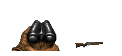||
|[273](https://github.com/alexey-lysiuk/Realm667-AAA-Cache/raw/master/data/0273.zip)|Swat Shotgun|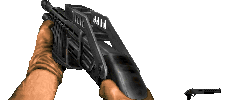||
|[423](https://github.com/alexey-lysiuk/Realm667-AAA-Cache/raw/master/data/0423.zip)|Toaster|||
|[912](https://github.com/alexey-lysiuk/Realm667-AAA-Cache/raw/master/data/0912.zip)|UAC Plasmatic Rifle|||
|[235](https://github.com/alexey-lysiuk/Realm667-AAA-Cache/raw/master/data/0235.zip)|Uber Minigun|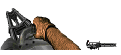||
|[243](https://github.com/alexey-lysiuk/Realm667-AAA-Cache/raw/master/data/0243.zip)|Unmaker|||
|[543](https://github.com/alexey-lysiuk/Realm667-AAA-Cache/raw/master/data/0543.zip)|UTNT Pyro-Cannon|||
|[227](https://github.com/alexey-lysiuk/Realm667-AAA-Cache/raw/master/data/0227.zip)|Uzi|||
|[274](https://github.com/alexey-lysiuk/Realm667-AAA-Cache/raw/master/data/0274.zip)|Western Shotgun|||
|[765](https://github.com/alexey-lysiuk/Realm667-AAA-Cache/raw/master/data/0765.zip)|Winchester Yellowboy|||
|[228](https://github.com/alexey-lysiuk/Realm667-AAA-Cache/raw/master/data/0228.zip)|Zombieman Rifle|||

[Back to table of content](../readme.md)
