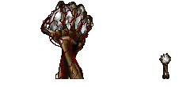
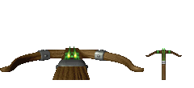
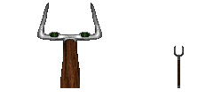

####Armory: Heretic / Hexen Style
|ID|Name|Preview|Comment|
|---|---|---|---|
|[327](../data/0327.zip)|Apotheosis|||
|[817](../data/0817.zip)|Arbalest of the Ancients|||
|[323](../data/0323.zip)|Blood Scepter|||
|[757](../data/0757.zip)|Bow|||
|[515](../data/0515.zip)|Cult of the Serpent Staff|||
|[626](../data/0626.zip)|D'sparil Staff|||
|[759](../data/0759.zip)|Fire Crystal|||
|[234](../data/0234.zip)|FrostFang|||
|[862](../data/0862.zip)|Impaler Crossbow|||
|[674](../data/0674.zip)|Iron Crossbow|||
|[324](../data/0324.zip)|Jade Wand|||
|[511](../data/0511.zip)|Lightbringer|||
|[675](../data/0675.zip)|Lightening Rod|||
|[444](../data/0444.zip)|Necronomicon|||
|[495](../data/0495.zip)|Raven Staff|||
|[518](../data/0518.zip)|Scepter of Souls|||
|[282](../data/0282.zip)|Skull Staff|||
|[328](../data/0328.zip)|Spellbinder|||
|[582](../data/0582.zip)|Super Crossbow|||
|[638](../data/0638.zip)|Thunder Fork|||
|[510](../data/0510.zip)|Vile Staff|||
|[473](../data/0473.zip)|Wand of Embers|||

[Back to table of content](../readme.md)
