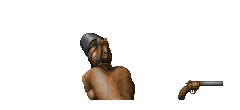

####Armory: Other Sources / Styles
|ID|Name|Preview|Comment|
|---|---|---|---|
|[697](https://github.com/alexey-lysiuk/Realm667-AAA-Cache/raw/master/data/0697.zip)|Bearkiller|||
|[253](https://github.com/alexey-lysiuk/Realm667-AAA-Cache/raw/master/data/0253.zip)|Blaster Rifle|||
|[241](https://github.com/alexey-lysiuk/Realm667-AAA-Cache/raw/master/data/0241.zip)|Devastator|||
|[422](https://github.com/alexey-lysiuk/Realm667-AAA-Cache/raw/master/data/0422.zip)|Deviation Launcher|||
|[408](https://github.com/alexey-lysiuk/Realm667-AAA-Cache/raw/master/data/0408.zip)|Drummle|||
|[404](https://github.com/alexey-lysiuk/Realm667-AAA-Cache/raw/master/data/0404.zip)|Enforcer|.png)||
|[236](https://github.com/alexey-lysiuk/Realm667-AAA-Cache/raw/master/data/0236.zip)|Flare Gun|||
|[686](https://github.com/alexey-lysiuk/Realm667-AAA-Cache/raw/master/data/0686.zip)|G3|||
|[263](https://github.com/alexey-lysiuk/Realm667-AAA-Cache/raw/master/data/0263.zip)|Hunter Shotgun|||
|[536](https://github.com/alexey-lysiuk/Realm667-AAA-Cache/raw/master/data/0536.zip)|Jackbomb|||
|[238](https://github.com/alexey-lysiuk/Realm667-AAA-Cache/raw/master/data/0238.zip)|M60|||
|[249](https://github.com/alexey-lysiuk/Realm667-AAA-Cache/raw/master/data/0249.zip)|Magnet Saw|||
|[266](https://github.com/alexey-lysiuk/Realm667-AAA-Cache/raw/master/data/0266.zip)|Napalm Launcher|||
|[267](https://github.com/alexey-lysiuk/Realm667-AAA-Cache/raw/master/data/0267.zip)|Necrovision MG40|||
|[230](https://github.com/alexey-lysiuk/Realm667-AAA-Cache/raw/master/data/0230.zip)|Plasma Gun|||
|[258](https://github.com/alexey-lysiuk/Realm667-AAA-Cache/raw/master/data/0258.zip)|Poly Morph|||
|[257](https://github.com/alexey-lysiuk/Realm667-AAA-Cache/raw/master/data/0257.zip)|Power Nailgun|||
|[269](https://github.com/alexey-lysiuk/Realm667-AAA-Cache/raw/master/data/0269.zip)|Pulse Machinegun|||
|[270](https://github.com/alexey-lysiuk/Realm667-AAA-Cache/raw/master/data/0270.zip)|PyroCannon|||
|[229](https://github.com/alexey-lysiuk/Realm667-AAA-Cache/raw/master/data/0229.zip)|Quake II Chaingun|||
|[314](https://github.com/alexey-lysiuk/Realm667-AAA-Cache/raw/master/data/0314.zip)|Revolver PS|||
|[271](https://github.com/alexey-lysiuk/Realm667-AAA-Cache/raw/master/data/0271.zip)|Saw Thrower|||
|[226](https://github.com/alexey-lysiuk/Realm667-AAA-Cache/raw/master/data/0226.zip)|Sawed Off|||
|[240](https://github.com/alexey-lysiuk/Realm667-AAA-Cache/raw/master/data/0240.zip)|Seeker Bazooka|||
|[231](https://github.com/alexey-lysiuk/Realm667-AAA-Cache/raw/master/data/0231.zip)|SMG|||
|[878](https://github.com/alexey-lysiuk/Realm667-AAA-Cache/raw/master/data/0878.zip)|Swarm Plasma Gun|||
|[252](https://github.com/alexey-lysiuk/Realm667-AAA-Cache/raw/master/data/0252.zip)|Tesla Cannon|||
|[283](https://github.com/alexey-lysiuk/Realm667-AAA-Cache/raw/master/data/0283.zip)|TommyGun|||

[Back to table of content](../readme.md)
