####Beastiary: Doom Style
|ID|Name|Preview|Comment|
|---|---|---|---|
|[7](https://github.com/alexey-lysiuk/Realm667-AAA-Cache/raw/master/data/0007.zip)|Afrit|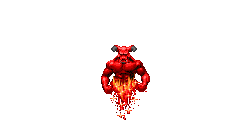||
|[8](https://github.com/alexey-lysiuk/Realm667-AAA-Cache/raw/master/data/0008.zip)|Agathodemon|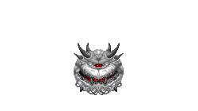||
|[316](https://github.com/alexey-lysiuk/Realm667-AAA-Cache/raw/master/data/0316.zip)|Agaures|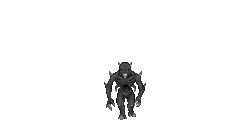||
|[9](https://github.com/alexey-lysiuk/Realm667-AAA-Cache/raw/master/data/0009.zip)|Annihilator|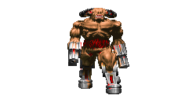||
|[284](https://github.com/alexey-lysiuk/Realm667-AAA-Cache/raw/master/data/0284.zip)|Arachnobaron|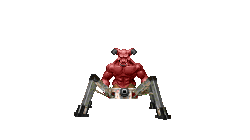||
|[11](https://github.com/alexey-lysiuk/Realm667-AAA-Cache/raw/master/data/0011.zip)|Arachnophyte|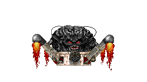||
|[285](https://github.com/alexey-lysiuk/Realm667-AAA-Cache/raw/master/data/0285.zip)|Aracnorb|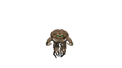||
|[931](https://github.com/alexey-lysiuk/Realm667-AAA-Cache/raw/master/data/0931.zip)|Aracnorb Queen|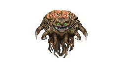||
|[12](https://github.com/alexey-lysiuk/Realm667-AAA-Cache/raw/master/data/0012.zip)|Archon of Hell|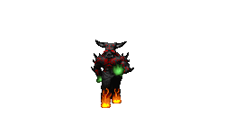||
|[768](https://github.com/alexey-lysiuk/Realm667-AAA-Cache/raw/master/data/0768.zip)|Augmented Arachnotron|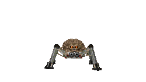||
|[555](https://github.com/alexey-lysiuk/Realm667-AAA-Cache/raw/master/data/0555.zip)|Auto Shotgun Guy|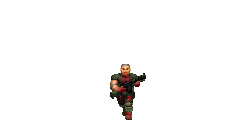||
|[148](https://github.com/alexey-lysiuk/Realm667-AAA-Cache/raw/master/data/0148.zip)|Azazel|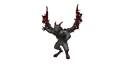||
|[877](https://github.com/alexey-lysiuk/Realm667-AAA-Cache/raw/master/data/0877.zip)|Baby Cacodemon|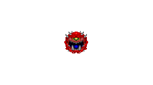||
|[779](https://github.com/alexey-lysiuk/Realm667-AAA-Cache/raw/master/data/0779.zip)|Bad|||
|[185](https://github.com/alexey-lysiuk/Realm667-AAA-Cache/raw/master/data/0185.zip)|Baphomet's Eyes|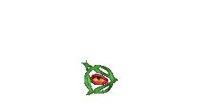||
|[788](https://github.com/alexey-lysiuk/Realm667-AAA-Cache/raw/master/data/0788.zip)|Beam Revenant|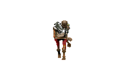||
|[550](https://github.com/alexey-lysiuk/Realm667-AAA-Cache/raw/master/data/0550.zip)|Beam Zombie|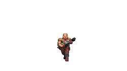||
|[317](https://github.com/alexey-lysiuk/Realm667-AAA-Cache/raw/master/data/0317.zip)|Beheaded Kamikaze|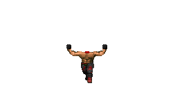||
|[15](https://github.com/alexey-lysiuk/Realm667-AAA-Cache/raw/master/data/0015.zip)|Belphegor|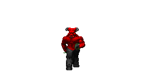||
|[451](https://github.com/alexey-lysiuk/Realm667-AAA-Cache/raw/master/data/0451.zip)|BFG Commando|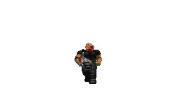||
|[16](https://github.com/alexey-lysiuk/Realm667-AAA-Cache/raw/master/data/0016.zip)|Blood Demon|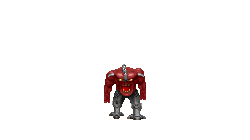||
|[17](https://github.com/alexey-lysiuk/Realm667-AAA-Cache/raw/master/data/0017.zip)|Blood Fiend|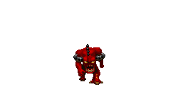||
|[907](https://github.com/alexey-lysiuk/Realm667-AAA-Cache/raw/master/data/0907.zip)|Blood Skull|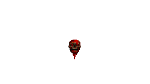||
|[309](https://github.com/alexey-lysiuk/Realm667-AAA-Cache/raw/master/data/0309.zip)|Blot|||
|[18](https://github.com/alexey-lysiuk/Realm667-AAA-Cache/raw/master/data/0018.zip)|Bruiser Demon|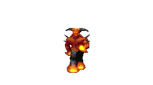||
|[20](https://github.com/alexey-lysiuk/Realm667-AAA-Cache/raw/master/data/0020.zip)|Cacolich|||
|[19](https://github.com/alexey-lysiuk/Realm667-AAA-Cache/raw/master/data/0019.zip)|Cacolantern|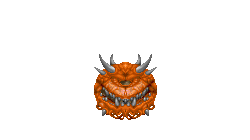||
|[21](https://github.com/alexey-lysiuk/Realm667-AAA-Cache/raw/master/data/0021.zip)|Catharsi|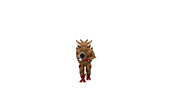||
|[814](https://github.com/alexey-lysiuk/Realm667-AAA-Cache/raw/master/data/0814.zip)|Chaingun Demon|||
|[22](https://github.com/alexey-lysiuk/Realm667-AAA-Cache/raw/master/data/0022.zip)|Chaingun Major|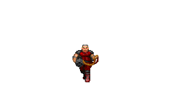||
|[194](https://github.com/alexey-lysiuk/Realm667-AAA-Cache/raw/master/data/0194.zip)|Chaingun Spider|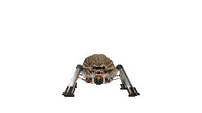||
|[23](https://github.com/alexey-lysiuk/Realm667-AAA-Cache/raw/master/data/0023.zip)|Chainsaw Zombie|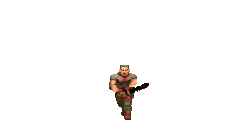||
|[620](https://github.com/alexey-lysiuk/Realm667-AAA-Cache/raw/master/data/0620.zip)|Chesire Cacodemon|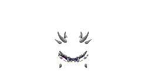||
|[24](https://github.com/alexey-lysiuk/Realm667-AAA-Cache/raw/master/data/0024.zip)|Core Tentacles|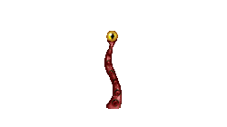||
|[25](https://github.com/alexey-lysiuk/Realm667-AAA-Cache/raw/master/data/0025.zip)|Cracko Demon|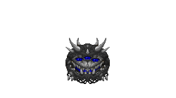||
|[807](https://github.com/alexey-lysiuk/Realm667-AAA-Cache/raw/master/data/0807.zip)|Crash|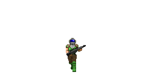||
|[27](https://github.com/alexey-lysiuk/Realm667-AAA-Cache/raw/master/data/0027.zip)|Cyber Baron|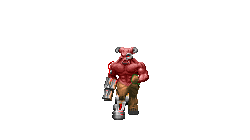||
|[331](https://github.com/alexey-lysiuk/Realm667-AAA-Cache/raw/master/data/0331.zip)|Cyber Fiend|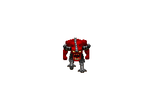||
|[809](https://github.com/alexey-lysiuk/Realm667-AAA-Cache/raw/master/data/0809.zip)|Cyber Imp|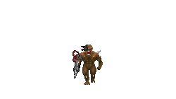||
|[28](https://github.com/alexey-lysiuk/Realm667-AAA-Cache/raw/master/data/0028.zip)|Cyber Mastermind|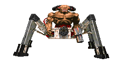||
|[29](https://github.com/alexey-lysiuk/Realm667-AAA-Cache/raw/master/data/0029.zip)|Cybruiser|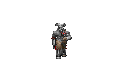||
|[334](https://github.com/alexey-lysiuk/Realm667-AAA-Cache/raw/master/data/0334.zip)|Dark Cardinal|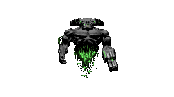||
|[472](https://github.com/alexey-lysiuk/Realm667-AAA-Cache/raw/master/data/0472.zip)|Dark Imp Pack|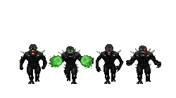||
|[33](https://github.com/alexey-lysiuk/Realm667-AAA-Cache/raw/master/data/0033.zip)|Darkness Rift|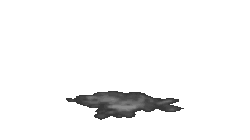||
|[34](https://github.com/alexey-lysiuk/Realm667-AAA-Cache/raw/master/data/0034.zip)|Death Incarnate|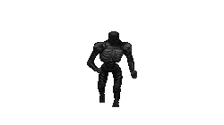||
|[569](https://github.com/alexey-lysiuk/Realm667-AAA-Cache/raw/master/data/0569.zip)|Deep One|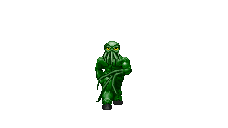||
|[177](https://github.com/alexey-lysiuk/Realm667-AAA-Cache/raw/master/data/0177.zip)|Defiler|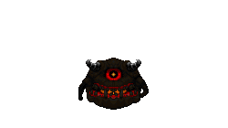||
|[36](https://github.com/alexey-lysiuk/Realm667-AAA-Cache/raw/master/data/0036.zip)|Demolisher|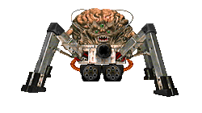||
|[633](https://github.com/alexey-lysiuk/Realm667-AAA-Cache/raw/master/data/0633.zip)|Devastator Zombie|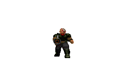||
|[37](https://github.com/alexey-lysiuk/Realm667-AAA-Cache/raw/master/data/0037.zip)|Devil|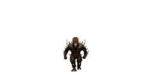||
|[38](https://github.com/alexey-lysiuk/Realm667-AAA-Cache/raw/master/data/0038.zip)|Diabolist|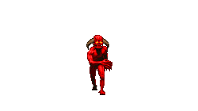||
|[40](https://github.com/alexey-lysiuk/Realm667-AAA-Cache/raw/master/data/0040.zip)|Double Chaingunner|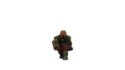||
|[41](https://github.com/alexey-lysiuk/Realm667-AAA-Cache/raw/master/data/0041.zip)|Dune Warrior|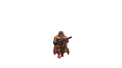||
|[42](https://github.com/alexey-lysiuk/Realm667-AAA-Cache/raw/master/data/0042.zip)|Enhanced Cacodemon|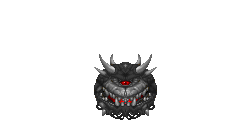||
|[43](https://github.com/alexey-lysiuk/Realm667-AAA-Cache/raw/master/data/0043.zip)|Ethereal Soul|||
|[908](https://github.com/alexey-lysiuk/Realm667-AAA-Cache/raw/master/data/0908.zip)|Exterminator|||
|[44](https://github.com/alexey-lysiuk/Realm667-AAA-Cache/raw/master/data/0044.zip)|Fallen|||
|~~[688](https://github.com/alexey-lysiuk/Realm667-AAA-Cache/raw/master/data/0688.zip)~~|~~Female Scientist~~||Excluded from generated package|
|[488](https://github.com/alexey-lysiuk/Realm667-AAA-Cache/raw/master/data/0488.zip)|Female Zombie Pack|||
|[410](https://github.com/alexey-lysiuk/Realm667-AAA-Cache/raw/master/data/0410.zip)|Flamer Zombie|||
|[415](https://github.com/alexey-lysiuk/Realm667-AAA-Cache/raw/master/data/0415.zip)|Flesh Spawn|||
|[186](https://github.com/alexey-lysiuk/Realm667-AAA-Cache/raw/master/data/0186.zip)|Flesh Wizard|||
|[45](https://github.com/alexey-lysiuk/Realm667-AAA-Cache/raw/master/data/0045.zip)|Flying Imp|||
|[556](https://github.com/alexey-lysiuk/Realm667-AAA-Cache/raw/master/data/0556.zip)|Forgotten One|||
|[900](https://github.com/alexey-lysiuk/Realm667-AAA-Cache/raw/master/data/0900.zip)|Former Ranger|||
|[802](https://github.com/alexey-lysiuk/Realm667-AAA-Cache/raw/master/data/0802.zip)|Former Scientists Pack|||
|[865](https://github.com/alexey-lysiuk/Realm667-AAA-Cache/raw/master/data/0865.zip)|Former Scientists Pack 2|||
|[333](https://github.com/alexey-lysiuk/Realm667-AAA-Cache/raw/master/data/0333.zip)|Freezer Zombie|||
|[46](https://github.com/alexey-lysiuk/Realm667-AAA-Cache/raw/master/data/0046.zip)|Fusion Spider|||
|[769](https://github.com/alexey-lysiuk/Realm667-AAA-Cache/raw/master/data/0769.zip)|Grell|||
|[48](https://github.com/alexey-lysiuk/Realm667-AAA-Cache/raw/master/data/0048.zip)|Guardian Cube|||
|[51](https://github.com/alexey-lysiuk/Realm667-AAA-Cache/raw/master/data/0051.zip)|Hades Elemental|||
|[49](https://github.com/alexey-lysiuk/Realm667-AAA-Cache/raw/master/data/0049.zip)|Hades Sphere|||
|[952](https://github.com/alexey-lysiuk/Realm667-AAA-Cache/raw/master/data/0952.zip)|Haedexebus|||
|[191](https://github.com/alexey-lysiuk/Realm667-AAA-Cache/raw/master/data/0191.zip)|Hangman|||
|[864](https://github.com/alexey-lysiuk/Realm667-AAA-Cache/raw/master/data/0864.zip)|Hazmat Zombie|||
|[605](https://github.com/alexey-lysiuk/Realm667-AAA-Cache/raw/master/data/0605.zip)|Heaven Guard|||
|[50](https://github.com/alexey-lysiuk/Realm667-AAA-Cache/raw/master/data/0050.zip)|Hectebus|||
|[56](https://github.com/alexey-lysiuk/Realm667-AAA-Cache/raw/master/data/0056.zip)|Hell Warrior|||
|[57](https://github.com/alexey-lysiuk/Realm667-AAA-Cache/raw/master/data/0057.zip)|Hell's Fury|||
|[183](https://github.com/alexey-lysiuk/Realm667-AAA-Cache/raw/master/data/0183.zip)|Hellion|||
|[59](https://github.com/alexey-lysiuk/Realm667-AAA-Cache/raw/master/data/0059.zip)|Hellstorm Archon|||
|[552](https://github.com/alexey-lysiuk/Realm667-AAA-Cache/raw/master/data/0552.zip)|Hierophant|||
|[60](https://github.com/alexey-lysiuk/Realm667-AAA-Cache/raw/master/data/0060.zip)|Illus|||
|[61](https://github.com/alexey-lysiuk/Realm667-AAA-Cache/raw/master/data/0061.zip)|Imp Trite|||
|[477](https://github.com/alexey-lysiuk/Realm667-AAA-Cache/raw/master/data/0477.zip)|Imp Variants|||
|[63](https://github.com/alexey-lysiuk/Realm667-AAA-Cache/raw/master/data/0063.zip)|Inferno|||
|[288](https://github.com/alexey-lysiuk/Realm667-AAA-Cache/raw/master/data/0288.zip)|Jetpack Zombie|||
|[553](https://github.com/alexey-lysiuk/Realm667-AAA-Cache/raw/master/data/0553.zip)|Karasawa Zombie|||
|[150](https://github.com/alexey-lysiuk/Realm667-AAA-Cache/raw/master/data/0150.zip)|Lesser Mutant|||
|[64](https://github.com/alexey-lysiuk/Realm667-AAA-Cache/raw/master/data/0064.zip)|Lord of Heresy|||
|[65](https://github.com/alexey-lysiuk/Realm667-AAA-Cache/raw/master/data/0065.zip)|Mauler Demon|||
|[901](https://github.com/alexey-lysiuk/Realm667-AAA-Cache/raw/master/data/0901.zip)|Minigunner|||
|[66](https://github.com/alexey-lysiuk/Realm667-AAA-Cache/raw/master/data/0066.zip)|Nail Borg|||
|[337](https://github.com/alexey-lysiuk/Realm667-AAA-Cache/raw/master/data/0337.zip)|Nail Borg Commando|||
|[69](https://github.com/alexey-lysiuk/Realm667-AAA-Cache/raw/master/data/0069.zip)|Nightmare|||
|[70](https://github.com/alexey-lysiuk/Realm667-AAA-Cache/raw/master/data/0070.zip)|Nightmare Demon|||
|[954](https://github.com/alexey-lysiuk/Realm667-AAA-Cache/raw/master/data/0954.zip)|Nightmare Spectre|||
|[369](https://github.com/alexey-lysiuk/Realm667-AAA-Cache/raw/master/data/0369.zip)|Nightshade|||
|[72](https://github.com/alexey-lysiuk/Realm667-AAA-Cache/raw/master/data/0072.zip)|Obsidian Statue|||
|[289](https://github.com/alexey-lysiuk/Realm667-AAA-Cache/raw/master/data/0289.zip)|Overlord|||
|[859](https://github.com/alexey-lysiuk/Realm667-AAA-Cache/raw/master/data/0859.zip)|Phantasm|||
|[151](https://github.com/alexey-lysiuk/Realm667-AAA-Cache/raw/master/data/0151.zip)|Phantom|||
|[178](https://github.com/alexey-lysiuk/Realm667-AAA-Cache/raw/master/data/0178.zip)|Phase Imp|||
|[71](https://github.com/alexey-lysiuk/Realm667-AAA-Cache/raw/master/data/0071.zip)|Plasma Demon|||
|[73](https://github.com/alexey-lysiuk/Realm667-AAA-Cache/raw/master/data/0073.zip)|Plasma Elemental|||
|[74](https://github.com/alexey-lysiuk/Realm667-AAA-Cache/raw/master/data/0074.zip)|Plasma Zombie|||
|[300](https://github.com/alexey-lysiuk/Realm667-AAA-Cache/raw/master/data/0300.zip)|Poe|||
|[75](https://github.com/alexey-lysiuk/Realm667-AAA-Cache/raw/master/data/0075.zip)|Poison Soul|||
|[339](https://github.com/alexey-lysiuk/Realm667-AAA-Cache/raw/master/data/0339.zip)|Profane One|||
|[76](https://github.com/alexey-lysiuk/Realm667-AAA-Cache/raw/master/data/0076.zip)|Psychic Soul|||
|[774](https://github.com/alexey-lysiuk/Realm667-AAA-Cache/raw/master/data/0774.zip)|Pulse Nailgun Zombie|||
|[144](https://github.com/alexey-lysiuk/Realm667-AAA-Cache/raw/master/data/0144.zip)|Pyro Demon|||
|[319](https://github.com/alexey-lysiuk/Realm667-AAA-Cache/raw/master/data/0319.zip)|Pyro Imp|||
|[798](https://github.com/alexey-lysiuk/Realm667-AAA-Cache/raw/master/data/0798.zip)|Pyro Zombie|||
|[456](https://github.com/alexey-lysiuk/Realm667-AAA-Cache/raw/master/data/0456.zip)|Quad-Shotgun Zombie|||
|[77](https://github.com/alexey-lysiuk/Realm667-AAA-Cache/raw/master/data/0077.zip)|Rail Arachnotron|||
|[188](https://github.com/alexey-lysiuk/Realm667-AAA-Cache/raw/master/data/0188.zip)|Rail Bot|||
|[78](https://github.com/alexey-lysiuk/Realm667-AAA-Cache/raw/master/data/0078.zip)|Rapid Fire Trooper|||
|[290](https://github.com/alexey-lysiuk/Realm667-AAA-Cache/raw/master/data/0290.zip)|Repeater Zombie|||
|[147](https://github.com/alexey-lysiuk/Realm667-AAA-Cache/raw/master/data/0147.zip)|Rictus|||
|[910](https://github.com/alexey-lysiuk/Realm667-AAA-Cache/raw/master/data/0910.zip)|Rifle Commando|||
|[291](https://github.com/alexey-lysiuk/Realm667-AAA-Cache/raw/master/data/0291.zip)|Roach|||
|[79](https://github.com/alexey-lysiuk/Realm667-AAA-Cache/raw/master/data/0079.zip)|Rocket Zombie|||
|[299](https://github.com/alexey-lysiuk/Realm667-AAA-Cache/raw/master/data/0299.zip)|Rocket Zombie II|||
|[320](https://github.com/alexey-lysiuk/Realm667-AAA-Cache/raw/master/data/0320.zip)|Rottweiler|||
|[80](https://github.com/alexey-lysiuk/Realm667-AAA-Cache/raw/master/data/0080.zip)|Satyr|||
|[301](https://github.com/alexey-lysiuk/Realm667-AAA-Cache/raw/master/data/0301.zip)|SawedOff Zombie|||
|[292](https://github.com/alexey-lysiuk/Realm667-AAA-Cache/raw/master/data/0292.zip)|Segway Zombie|||
|[575](https://github.com/alexey-lysiuk/Realm667-AAA-Cache/raw/master/data/0575.zip)|Shade|||
|[82](https://github.com/alexey-lysiuk/Realm667-AAA-Cache/raw/master/data/0082.zip)|Shadow|||
|[902](https://github.com/alexey-lysiuk/Realm667-AAA-Cache/raw/master/data/0902.zip)|Shadow Trooper|||
|[83](https://github.com/alexey-lysiuk/Realm667-AAA-Cache/raw/master/data/0083.zip)|SlimeImp|||
|[179](https://github.com/alexey-lysiuk/Realm667-AAA-Cache/raw/master/data/0179.zip)|Slime Worm|||
|[602](https://github.com/alexey-lysiuk/Realm667-AAA-Cache/raw/master/data/0602.zip)|SMG Zombie|||
|[770](https://github.com/alexey-lysiuk/Realm667-AAA-Cache/raw/master/data/0770.zip)|Smoke Monster|||
|[84](https://github.com/alexey-lysiuk/Realm667-AAA-Cache/raw/master/data/0084.zip)|Snake Imp|||
|[322](https://github.com/alexey-lysiuk/Realm667-AAA-Cache/raw/master/data/0322.zip)|Sniper Zombie|||
|[294](https://github.com/alexey-lysiuk/Realm667-AAA-Cache/raw/master/data/0294.zip)|Sonic Railgun Zombie|||
|[85](https://github.com/alexey-lysiuk/Realm667-AAA-Cache/raw/master/data/0085.zip)|Soul Harvester|||
|[86](https://github.com/alexey-lysiuk/Realm667-AAA-Cache/raw/master/data/0086.zip)|Spirit Imp|||
|[307](https://github.com/alexey-lysiuk/Realm667-AAA-Cache/raw/master/data/0307.zip)|Squire|||
|[815](https://github.com/alexey-lysiuk/Realm667-AAA-Cache/raw/master/data/0815.zip)|Stalker|||
|[87](https://github.com/alexey-lysiuk/Realm667-AAA-Cache/raw/master/data/0087.zip)|Stealth Fighter|||
|[88](https://github.com/alexey-lysiuk/Realm667-AAA-Cache/raw/master/data/0088.zip)|Stone Demon|||
|[89](https://github.com/alexey-lysiuk/Realm667-AAA-Cache/raw/master/data/0089.zip)|Stone Imp|||
|[90](https://github.com/alexey-lysiuk/Realm667-AAA-Cache/raw/master/data/0090.zip)|Suicide Bomber|||
|[296](https://github.com/alexey-lysiuk/Realm667-AAA-Cache/raw/master/data/0296.zip)|Super Demon|||
|[295](https://github.com/alexey-lysiuk/Realm667-AAA-Cache/raw/master/data/0295.zip)|Super Flying Imp|||
|[91](https://github.com/alexey-lysiuk/Realm667-AAA-Cache/raw/master/data/0091.zip)|Super Imp|||
|[92](https://github.com/alexey-lysiuk/Realm667-AAA-Cache/raw/master/data/0092.zip)|Super Shotgun Zombie|||
|[190](https://github.com/alexey-lysiuk/Realm667-AAA-Cache/raw/master/data/0190.zip)|Supreme Fiend|||
|[297](https://github.com/alexey-lysiuk/Realm667-AAA-Cache/raw/master/data/0297.zip)|Swarm|||
|[153](https://github.com/alexey-lysiuk/Realm667-AAA-Cache/raw/master/data/0153.zip)|Terminator|||
|[93](https://github.com/alexey-lysiuk/Realm667-AAA-Cache/raw/master/data/0093.zip)|Terror|||
|[312](https://github.com/alexey-lysiuk/Realm667-AAA-Cache/raw/master/data/0312.zip)|Tesla Coil|||
|[94](https://github.com/alexey-lysiuk/Realm667-AAA-Cache/raw/master/data/0094.zip)|Thamuz|||
|[749](https://github.com/alexey-lysiuk/Realm667-AAA-Cache/raw/master/data/0749.zip)|Time Imp|||
|[96](https://github.com/alexey-lysiuk/Realm667-AAA-Cache/raw/master/data/0096.zip)|Tornado Demon|||
|[97](https://github.com/alexey-lysiuk/Realm667-AAA-Cache/raw/master/data/0097.zip)|Tortured Soul|||
|[557](https://github.com/alexey-lysiuk/Realm667-AAA-Cache/raw/master/data/0557.zip)|Trite|||
|[505](https://github.com/alexey-lysiuk/Realm667-AAA-Cache/raw/master/data/0505.zip)|UAC Bot|||
|[606](https://github.com/alexey-lysiuk/Realm667-AAA-Cache/raw/master/data/0606.zip)|Undead Hunter|||
|[193](https://github.com/alexey-lysiuk/Realm667-AAA-Cache/raw/master/data/0193.zip)|Undead Priest|||
|[298](https://github.com/alexey-lysiuk/Realm667-AAA-Cache/raw/master/data/0298.zip)|Unmaker Zombie|||
|[812](https://github.com/alexey-lysiuk/Realm667-AAA-Cache/raw/master/data/0812.zip)|Volacubi|||
|[100](https://github.com/alexey-lysiuk/Realm667-AAA-Cache/raw/master/data/0100.zip)|Vulgar|||
|[101](https://github.com/alexey-lysiuk/Realm667-AAA-Cache/raw/master/data/0101.zip)|Warlord of Hell|||
|[102](https://github.com/alexey-lysiuk/Realm667-AAA-Cache/raw/master/data/0102.zip)|Watcher|||
|[748](https://github.com/alexey-lysiuk/Realm667-AAA-Cache/raw/master/data/0748.zip)|Weakener|||
|[184](https://github.com/alexey-lysiuk/Realm667-AAA-Cache/raw/master/data/0184.zip)|Wicked|||
|[571](https://github.com/alexey-lysiuk/Realm667-AAA-Cache/raw/master/data/0571.zip)|Doom III Wraith|||
|[104](https://github.com/alexey-lysiuk/Realm667-AAA-Cache/raw/master/data/0104.zip)|ZSec|||
|[182](https://github.com/alexey-lysiuk/Realm667-AAA-Cache/raw/master/data/0182.zip)|Zombie Flyer|||
|[448](https://github.com/alexey-lysiuk/Realm667-AAA-Cache/raw/master/data/0448.zip)|Zombie Henchman|||
|[105](https://github.com/alexey-lysiuk/Realm667-AAA-Cache/raw/master/data/0105.zip)|Zombie Marine|||
|[911](https://github.com/alexey-lysiuk/Realm667-AAA-Cache/raw/master/data/0911.zip)|Zombie Missile Tank|||
|[946](https://github.com/alexey-lysiuk/Realm667-AAA-Cache/raw/master/data/0946.zip)|Zombie Plasma Scientist|||
|[341](https://github.com/alexey-lysiuk/Realm667-AAA-Cache/raw/master/data/0341.zip)|Zombie Plasma Tank|||
|[106](https://github.com/alexey-lysiuk/Realm667-AAA-Cache/raw/master/data/0106.zip)|Zombie Railgunner|||
|~~[730](https://github.com/alexey-lysiuk/Realm667-AAA-Cache/raw/master/data/0730.zip)~~|~~Zombie Scientist~~||Excluded from generated package|
|[107](https://github.com/alexey-lysiuk/Realm667-AAA-Cache/raw/master/data/0107.zip)|ZombieTank|||
|[554](https://github.com/alexey-lysiuk/Realm667-AAA-Cache/raw/master/data/0554.zip)|ZSpecOps|||

[Back to table of content](../readme.md)
