####Beastiary: Heretic / Hexen Style
|ID|Name|Preview|Comment|
|---|---|---|---|
|[6](https://github.com/alexey-lysiuk/Realm667-AAA-Cache/raw/master/data/0006.zip)|Acolyte|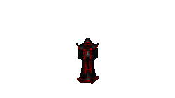||
|[10](https://github.com/alexey-lysiuk/Realm667-AAA-Cache/raw/master/data/0010.zip)|Apprentice of D'Sparil|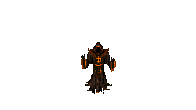||
|[13](https://github.com/alexey-lysiuk/Realm667-AAA-Cache/raw/master/data/0013.zip)|Avatar|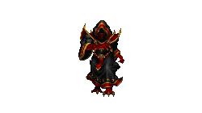||
|[572](https://github.com/alexey-lysiuk/Realm667-AAA-Cache/raw/master/data/0572.zip)|Banshee|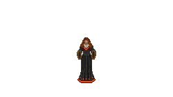||
|[539](https://github.com/alexey-lysiuk/Realm667-AAA-Cache/raw/master/data/0539.zip)|Blood Lich|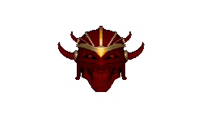||
|[152](https://github.com/alexey-lysiuk/Realm667-AAA-Cache/raw/master/data/0152.zip)|Bormereth|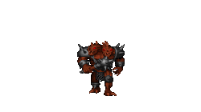||
|[540](https://github.com/alexey-lysiuk/Realm667-AAA-Cache/raw/master/data/0540.zip)|Boss Shooters|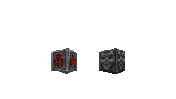||
|[195](https://github.com/alexey-lysiuk/Realm667-AAA-Cache/raw/master/data/0195.zip)|Butcher|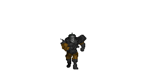||
|[914](https://github.com/alexey-lysiuk/Realm667-AAA-Cache/raw/master/data/0914.zip)|Chainmail Ettin|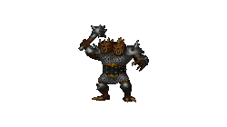||
|[551](https://github.com/alexey-lysiuk/Realm667-AAA-Cache/raw/master/data/0551.zip)|Chaos Wyvern|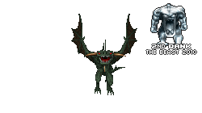||
|[433](https://github.com/alexey-lysiuk/Realm667-AAA-Cache/raw/master/data/0433.zip)|Chiller|||
|[808](https://github.com/alexey-lysiuk/Realm667-AAA-Cache/raw/master/data/0808.zip)|Crimson Disciple|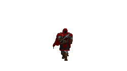||
|[26](https://github.com/alexey-lysiuk/Realm667-AAA-Cache/raw/master/data/0026.zip)|Cultist|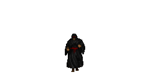||
|[286](https://github.com/alexey-lysiuk/Realm667-AAA-Cache/raw/master/data/0286.zip)|Dark Clink|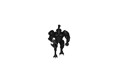||
|[468](https://github.com/alexey-lysiuk/Realm667-AAA-Cache/raw/master/data/0468.zip)|Dark Gargoyle|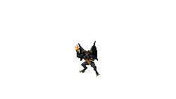||
|[35](https://github.com/alexey-lysiuk/Realm667-AAA-Cache/raw/master/data/0035.zip)|Death Knight|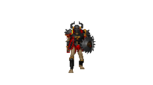||
|[915](https://github.com/alexey-lysiuk/Realm667-AAA-Cache/raw/master/data/0915.zip)|Demon Wizard|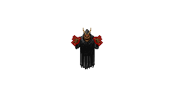||
|[39](https://github.com/alexey-lysiuk/Realm667-AAA-Cache/raw/master/data/0039.zip)|Disciple|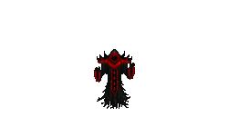||
|[794](https://github.com/alexey-lysiuk/Realm667-AAA-Cache/raw/master/data/0794.zip)|Disciple (with melee)|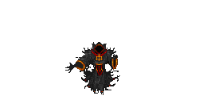||
|[47](https://github.com/alexey-lysiuk/Realm667-AAA-Cache/raw/master/data/0047.zip)|Ghoul|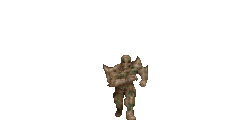||
|[745](https://github.com/alexey-lysiuk/Realm667-AAA-Cache/raw/master/data/0745.zip)|Gold Lich|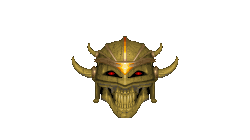||
|[52](https://github.com/alexey-lysiuk/Realm667-AAA-Cache/raw/master/data/0052.zip)|Hell Apprentice|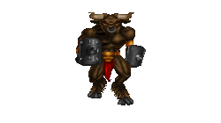||
|[58](https://github.com/alexey-lysiuk/Realm667-AAA-Cache/raw/master/data/0058.zip)|Hell Guard|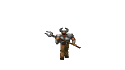||
|[55](https://github.com/alexey-lysiuk/Realm667-AAA-Cache/raw/master/data/0055.zip)|Hell Smith|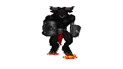||
|[836](https://github.com/alexey-lysiuk/Realm667-AAA-Cache/raw/master/data/0836.zip)|Hex Prism|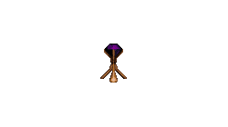||
|[192](https://github.com/alexey-lysiuk/Realm667-AAA-Cache/raw/master/data/0192.zip)|Horn Beast|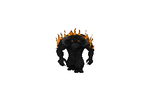||
|[310](https://github.com/alexey-lysiuk/Realm667-AAA-Cache/raw/master/data/0310.zip)|Hornet|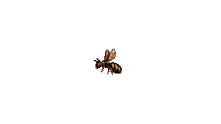||
|[726](https://github.com/alexey-lysiuk/Realm667-AAA-Cache/raw/master/data/0726.zip)|Ice Golem|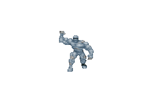||
|[573](https://github.com/alexey-lysiuk/Realm667-AAA-Cache/raw/master/data/0573.zip)|Ice Lich|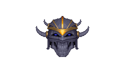||
|[470](https://github.com/alexey-lysiuk/Realm667-AAA-Cache/raw/master/data/0470.zip)|Ice Stalker|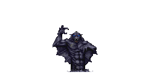||
|[62](https://github.com/alexey-lysiuk/Realm667-AAA-Cache/raw/master/data/0062.zip)|Imp Warlord|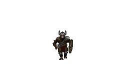||
|[287](https://github.com/alexey-lysiuk/Realm667-AAA-Cache/raw/master/data/0287.zip)|Inferno Demon|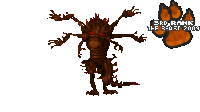||
|[196](https://github.com/alexey-lysiuk/Realm667-AAA-Cache/raw/master/data/0196.zip)|Invisible Warrior|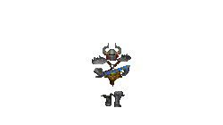||
|[187](https://github.com/alexey-lysiuk/Realm667-AAA-Cache/raw/master/data/0187.zip)|Knight Archer|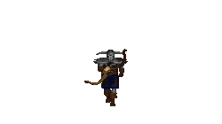||
|[493](https://github.com/alexey-lysiuk/Realm667-AAA-Cache/raw/master/data/0493.zip)|Lava Demon|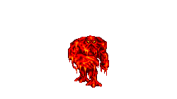||
|[899](https://github.com/alexey-lysiuk/Realm667-AAA-Cache/raw/master/data/0899.zip)|Lost Spirit|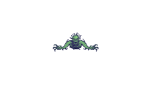||
|[574](https://github.com/alexey-lysiuk/Realm667-AAA-Cache/raw/master/data/0574.zip)|Magma Serpent|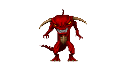||
|[687](https://github.com/alexey-lysiuk/Realm667-AAA-Cache/raw/master/data/0687.zip)|Medusa|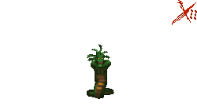||
|[839](https://github.com/alexey-lysiuk/Realm667-AAA-Cache/raw/master/data/0839.zip)|Nosferati|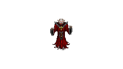||
|[747](https://github.com/alexey-lysiuk/Realm667-AAA-Cache/raw/master/data/0747.zip)|Plague Imp|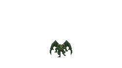||
|[846](https://github.com/alexey-lysiuk/Realm667-AAA-Cache/raw/master/data/0846.zip)|Pyro Succubus|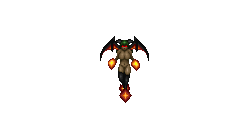||
|[494](https://github.com/alexey-lysiuk/Realm667-AAA-Cache/raw/master/data/0494.zip)|Rot Wraith|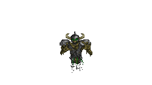||
|[321](https://github.com/alexey-lysiuk/Realm667-AAA-Cache/raw/master/data/0321.zip)|Scimitar|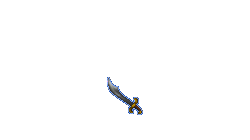||
|[81](https://github.com/alexey-lysiuk/Realm667-AAA-Cache/raw/master/data/0081.zip)|Sentinel|||
|[293](https://github.com/alexey-lysiuk/Realm667-AAA-Cache/raw/master/data/0293.zip)|Shadow Beast|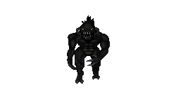||
|[95](https://github.com/alexey-lysiuk/Realm667-AAA-Cache/raw/master/data/0095.zip)|Thor|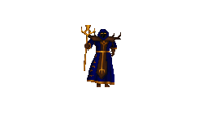||
|[810](https://github.com/alexey-lysiuk/Realm667-AAA-Cache/raw/master/data/0810.zip)|Undead Knight (Dual Axe)|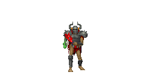||
|[355](https://github.com/alexey-lysiuk/Realm667-AAA-Cache/raw/master/data/0355.zip)|Vampire|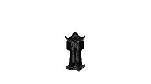||
|[103](https://github.com/alexey-lysiuk/Realm667-AAA-Cache/raw/master/data/0103.zip)|Wraith|||
|[607](https://github.com/alexey-lysiuk/Realm667-AAA-Cache/raw/master/data/0607.zip)|Zardaz|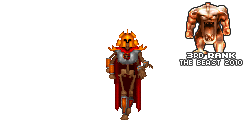||

[Back to table of content](../readme.md)
