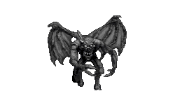
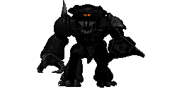
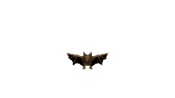
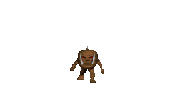
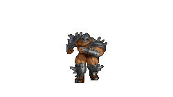
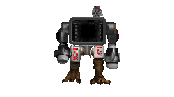
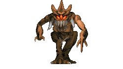
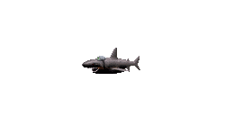

####Beastiary: Other Style
|ID|Name|Preview|Comment|
|---|---|---|---|
|[14](https://github.com/alexey-lysiuk/Realm667-AAA-Cache/raw/master/data/0014.zip)|Bat|||
|[436](https://github.com/alexey-lysiuk/Realm667-AAA-Cache/raw/master/data/0436.zip)|Cheogh|||
|[634](https://github.com/alexey-lysiuk/Realm667-AAA-Cache/raw/master/data/0634.zip)|Drone|||
|[863](https://github.com/alexey-lysiuk/Realm667-AAA-Cache/raw/master/data/0863.zip)|Elite Guard|||
|[386](https://github.com/alexey-lysiuk/Realm667-AAA-Cache/raw/master/data/0386.zip)|Evil Knight|||
|[621](https://github.com/alexey-lysiuk/Realm667-AAA-Cache/raw/master/data/0621.zip)|Gatekeeper|||
|[469](https://github.com/alexey-lysiuk/Realm667-AAA-Cache/raw/master/data/0469.zip)|Giant Bat|||
|[709](https://github.com/alexey-lysiuk/Realm667-AAA-Cache/raw/master/data/0709.zip)|Giant Rat|||
|[336](https://github.com/alexey-lysiuk/Realm667-AAA-Cache/raw/master/data/0336.zip)|Head Monster|||
|[53](https://github.com/alexey-lysiuk/Realm667-AAA-Cache/raw/master/data/0053.zip)|Hell Hound|||
|[54](https://github.com/alexey-lysiuk/Realm667-AAA-Cache/raw/master/data/0054.zip)|Hell Rose|||
|[149](https://github.com/alexey-lysiuk/Realm667-AAA-Cache/raw/master/data/0149.zip)|Incubus|||
|[143](https://github.com/alexey-lysiuk/Realm667-AAA-Cache/raw/master/data/0143.zip)|Infernal Spider|||
|[471](https://github.com/alexey-lysiuk/Realm667-AAA-Cache/raw/master/data/0471.zip)|Juggernaut|||
|[622](https://github.com/alexey-lysiuk/Realm667-AAA-Cache/raw/master/data/0622.zip)|Maephisto|||
|[318](https://github.com/alexey-lysiuk/Realm667-AAA-Cache/raw/master/data/0318.zip)|Moloch|||
|[67](https://github.com/alexey-lysiuk/Realm667-AAA-Cache/raw/master/data/0067.zip)|Netherworld Drone|||
|[68](https://github.com/alexey-lysiuk/Realm667-AAA-Cache/raw/master/data/0068.zip)|Netherworld Queen|||
|[625](https://github.com/alexey-lysiuk/Realm667-AAA-Cache/raw/master/data/0625.zip)|Pustule|||
|[811](https://github.com/alexey-lysiuk/Realm667-AAA-Cache/raw/master/data/0811.zip)|Shark|||
|[958](https://github.com/alexey-lysiuk/Realm667-AAA-Cache/raw/master/data/0958.zip)|Shark with Laser|||
|[813](https://github.com/alexey-lysiuk/Realm667-AAA-Cache/raw/master/data/0813.zip)|Skeleton|||
|[189](https://github.com/alexey-lysiuk/Realm667-AAA-Cache/raw/master/data/0189.zip)|Source Guardian|||
|[623](https://github.com/alexey-lysiuk/Realm667-AAA-Cache/raw/master/data/0623.zip)|Trash Monster|||
|[777](https://github.com/alexey-lysiuk/Realm667-AAA-Cache/raw/master/data/0777.zip)|Vore||Removed from Repository|

[Back to table of content](../readme.md)
