####Item Store: Others
|ID|Name|Preview|Comment|
|---|---|---|---|
|[490](https://github.com/alexey-lysiuk/Realm667-AAA-Cache/raw/master/data/0490.zip)|Adrenaline Kit|||
|[375](https://github.com/alexey-lysiuk/Realm667-AAA-Cache/raw/master/data/0375.zip)|Ammo Belt|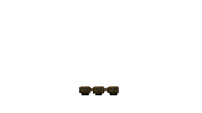||
|[437](https://github.com/alexey-lysiuk/Realm667-AAA-Cache/raw/master/data/0437.zip)|Armor Set|||
|[608](https://github.com/alexey-lysiuk/Realm667-AAA-Cache/raw/master/data/0608.zip)|Armor Shard|||
|[524](https://github.com/alexey-lysiuk/Realm667-AAA-Cache/raw/master/data/0524.zip)|Beacon|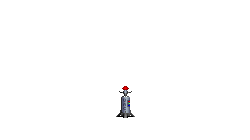||
|[387](https://github.com/alexey-lysiuk/Realm667-AAA-Cache/raw/master/data/0387.zip)|Biosuit|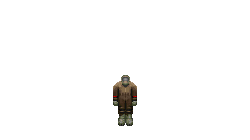||
|[497](https://github.com/alexey-lysiuk/Realm667-AAA-Cache/raw/master/data/0497.zip)|Blaze Orb|||
|[690](https://github.com/alexey-lysiuk/Realm667-AAA-Cache/raw/master/data/0690.zip)|Bullet Cartridge|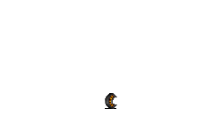||
|[393](https://github.com/alexey-lysiuk/Realm667-AAA-Cache/raw/master/data/0393.zip)|Bullet Kit|||
|[442](https://github.com/alexey-lysiuk/Realm667-AAA-Cache/raw/master/data/0442.zip)|Small Blood Container|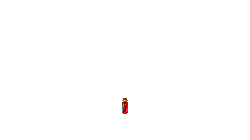||
|[438](https://github.com/alexey-lysiuk/Realm667-AAA-Cache/raw/master/data/0438.zip)|Large Blood Container|||
|[394](https://github.com/alexey-lysiuk/Realm667-AAA-Cache/raw/master/data/0394.zip)|Cell Kit|||
|[376](https://github.com/alexey-lysiuk/Realm667-AAA-Cache/raw/master/data/0376.zip)|Combat Pack|||
|[823](https://github.com/alexey-lysiuk/Realm667-AAA-Cache/raw/master/data/0823.zip)|Crusader Shield|||
|[498](https://github.com/alexey-lysiuk/Realm667-AAA-Cache/raw/master/data/0498.zip)|Crystal Gem|||
|[417](https://github.com/alexey-lysiuk/Realm667-AAA-Cache/raw/master/data/0417.zip)|Deployable Sentry Gun|||
|[957](https://github.com/alexey-lysiuk/Realm667-AAA-Cache/raw/master/data/0957.zip)|Deployable Shield|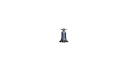||
|[691](https://github.com/alexey-lysiuk/Realm667-AAA-Cache/raw/master/data/0691.zip)|Electric Bolt Bundle|||
|[787](https://github.com/alexey-lysiuk/Realm667-AAA-Cache/raw/master/data/0787.zip)|Electric Pod|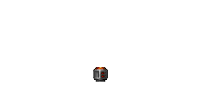||
|[860](https://github.com/alexey-lysiuk/Realm667-AAA-Cache/raw/master/data/0860.zip)|Elemental Gems|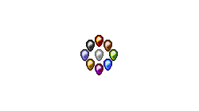||
|[692](https://github.com/alexey-lysiuk/Realm667-AAA-Cache/raw/master/data/0692.zip)|Energy Kit|||
|[500](https://github.com/alexey-lysiuk/Realm667-AAA-Cache/raw/master/data/0500.zip)|Ethereal Arrow Bundle|||
|[382](https://github.com/alexey-lysiuk/Realm667-AAA-Cache/raw/master/data/0382.zip)|Field Kit|||
|[828](https://github.com/alexey-lysiuk/Realm667-AAA-Cache/raw/master/data/0828.zip)|Flame Turret|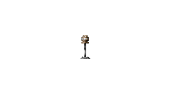||
|[565](https://github.com/alexey-lysiuk/Realm667-AAA-Cache/raw/master/data/0565.zip)|Flares|||
|[671](https://github.com/alexey-lysiuk/Realm667-AAA-Cache/raw/master/data/0671.zip)|Food Barrel|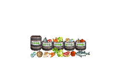||
|[501](https://github.com/alexey-lysiuk/Realm667-AAA-Cache/raw/master/data/0501.zip)|Greater Mace Sphere|||
|[693](https://github.com/alexey-lysiuk/Realm667-AAA-Cache/raw/master/data/0693.zip)|HE Grenade Box|||
|[869](https://github.com/alexey-lysiuk/Realm667-AAA-Cache/raw/master/data/0869.zip)|Jump Boots|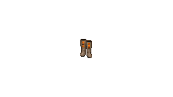||
|[478](https://github.com/alexey-lysiuk/Realm667-AAA-Cache/raw/master/data/0478.zip)|Heavy Armor|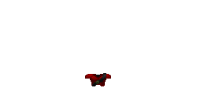||
|[896](https://github.com/alexey-lysiuk/Realm667-AAA-Cache/raw/master/data/0896.zip)|Magic Apples|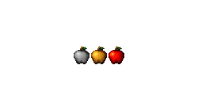||
|[956](https://github.com/alexey-lysiuk/Realm667-AAA-Cache/raw/master/data/0956.zip)|Marine Supply Pack|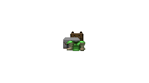||
|[502](https://github.com/alexey-lysiuk/Realm667-AAA-Cache/raw/master/data/0502.zip)|Median Runes|||
|[875](https://github.com/alexey-lysiuk/Realm667-AAA-Cache/raw/master/data/0875.zip)|Medical Backpack|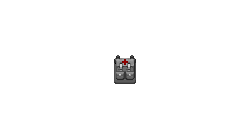||
|[371](https://github.com/alexey-lysiuk/Realm667-AAA-Cache/raw/master/data/0371.zip)|Medipack|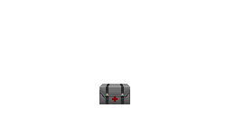||
|[377](https://github.com/alexey-lysiuk/Realm667-AAA-Cache/raw/master/data/0377.zip)|Mega Map|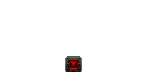||
|[576](https://github.com/alexey-lysiuk/Realm667-AAA-Cache/raw/master/data/0576.zip)|Megapack|||
|[694](https://github.com/alexey-lysiuk/Realm667-AAA-Cache/raw/master/data/0694.zip)|Mini Missile Bundle|||
|[795](https://github.com/alexey-lysiuk/Realm667-AAA-Cache/raw/master/data/0795.zip)|Missile Pod|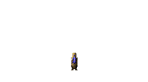||
|[712](https://github.com/alexey-lysiuk/Realm667-AAA-Cache/raw/master/data/0712.zip)|Oxygen Canister|||
|[439](https://github.com/alexey-lysiuk/Realm667-AAA-Cache/raw/master/data/0439.zip)|PDA|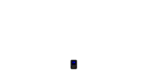||
|[695](https://github.com/alexey-lysiuk/Realm667-AAA-Cache/raw/master/data/0695.zip)|Phosphorus Grenade Box|||
|[696](https://github.com/alexey-lysiuk/Realm667-AAA-Cache/raw/master/data/0696.zip)|Poison Bolt Bundle|||
|[778](https://github.com/alexey-lysiuk/Realm667-AAA-Cache/raw/master/data/0778.zip)|Portable Rejuvenation Unit|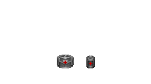||
|[656](https://github.com/alexey-lysiuk/Realm667-AAA-Cache/raw/master/data/0656.zip)|Potion Variants|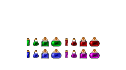||
|[499](https://github.com/alexey-lysiuk/Realm667-AAA-Cache/raw/master/data/0499.zip)|Power Orb|||
|[776](https://github.com/alexey-lysiuk/Realm667-AAA-Cache/raw/master/data/0776.zip)|Quake Item Pack|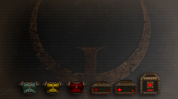||
|[395](https://github.com/alexey-lysiuk/Realm667-AAA-Cache/raw/master/data/0395.zip)|Rocket Pile|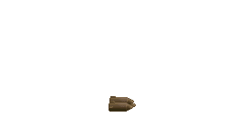||
|[396](https://github.com/alexey-lysiuk/Realm667-AAA-Cache/raw/master/data/0396.zip)|Shell Kit|||
|[926](https://github.com/alexey-lysiuk/Realm667-AAA-Cache/raw/master/data/0926.zip)|Shield Spells|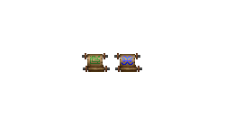||
|[835](https://github.com/alexey-lysiuk/Realm667-AAA-Cache/raw/master/data/0835.zip)|Sigil Scroll|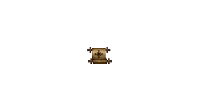||
|[689](https://github.com/alexey-lysiuk/Realm667-AAA-Cache/raw/master/data/0689.zip)|Spiritual Armor Orb|||
|[840](https://github.com/alexey-lysiuk/Realm667-AAA-Cache/raw/master/data/0840.zip)|Spring Mine|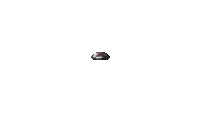||
|[628](https://github.com/alexey-lysiuk/Realm667-AAA-Cache/raw/master/data/0628.zip)|Stim Bonus|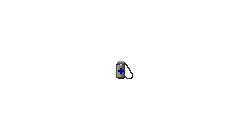||
|[383](https://github.com/alexey-lysiuk/Realm667-AAA-Cache/raw/master/data/0383.zip)|SuperStim|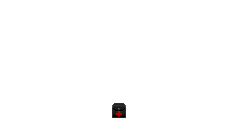||
|[930](https://github.com/alexey-lysiuk/Realm667-AAA-Cache/raw/master/data/0930.zip)|Super Armor Bonus|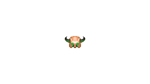||
|[566](https://github.com/alexey-lysiuk/Realm667-AAA-Cache/raw/master/data/0566.zip)|Super Shield|||
|[413](https://github.com/alexey-lysiuk/Realm667-AAA-Cache/raw/master/data/0413.zip)|Supply Box|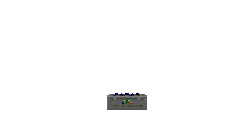||
|[881](https://github.com/alexey-lysiuk/Realm667-AAA-Cache/raw/master/data/0881.zip)|Swarmers|||
|[489](https://github.com/alexey-lysiuk/Realm667-AAA-Cache/raw/master/data/0489.zip)|Tech Armor|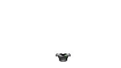||
|[831](https://github.com/alexey-lysiuk/Realm667-AAA-Cache/raw/master/data/0831.zip)|Vitality Serum|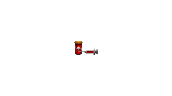||

[Back to table of content](../readme.md)
