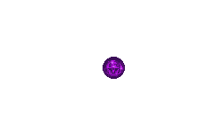
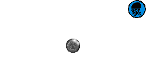
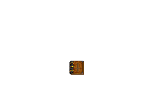

####Item Store: PowerUps & Artifacts
|ID|Name|Preview|Comment|
|---|---|---|---|
|[391](https://github.com/alexey-lysiuk/Realm667-AAA-Cache/raw/master/data/0391.zip)|AmmoSphere|||
|[827](https://github.com/alexey-lysiuk/Realm667-AAA-Cache/raw/master/data/0827.zip)|Ankh of Life|||
|[392](https://github.com/alexey-lysiuk/Realm667-AAA-Cache/raw/master/data/0392.zip)|Armor Sphere|||
|[399](https://github.com/alexey-lysiuk/Realm667-AAA-Cache/raw/master/data/0399.zip)|Berserk Sphere|||
|[479](https://github.com/alexey-lysiuk/Realm667-AAA-Cache/raw/master/data/0479.zip)|BioSphere|||
|[824](https://github.com/alexey-lysiuk/Realm667-AAA-Cache/raw/master/data/0824.zip)|Blood Amulet|||
|[385](https://github.com/alexey-lysiuk/Realm667-AAA-Cache/raw/master/data/0385.zip)|Bloodlust Sphere|||
|[711](https://github.com/alexey-lysiuk/Realm667-AAA-Cache/raw/master/data/0711.zip)|Book of the Dead|||
|[492](https://github.com/alexey-lysiuk/Realm667-AAA-Cache/raw/master/data/0492.zip)|Boots of the North|||
|[487](https://github.com/alexey-lysiuk/Realm667-AAA-Cache/raw/master/data/0487.zip)|Bracers of Force|||
|[830](https://github.com/alexey-lysiuk/Realm667-AAA-Cache/raw/master/data/0830.zip)|Crucifix Rosary|||
|[400](https://github.com/alexey-lysiuk/Realm667-AAA-Cache/raw/master/data/0400.zip)|Doom Sphere|||
|[416](https://github.com/alexey-lysiuk/Realm667-AAA-Cache/raw/master/data/0416.zip)|Double Damage Sphere|||
|[480](https://github.com/alexey-lysiuk/Realm667-AAA-Cache/raw/master/data/0480.zip)|Emerald Amulet|||
|[897](https://github.com/alexey-lysiuk/Realm667-AAA-Cache/raw/master/data/0897.zip)|Familiar Summon|||
|[370](https://github.com/alexey-lysiuk/Realm667-AAA-Cache/raw/master/data/0370.zip)|Flight Sphere|||
|[577](https://github.com/alexey-lysiuk/Realm667-AAA-Cache/raw/master/data/0577.zip)|Guard Sphere|||
|[506](https://github.com/alexey-lysiuk/Realm667-AAA-Cache/raw/master/data/0506.zip)|Hand of the Wraith|||
|[378](https://github.com/alexey-lysiuk/Realm667-AAA-Cache/raw/master/data/0378.zip)|Haste Sphere|||
|[535](https://github.com/alexey-lysiuk/Realm667-AAA-Cache/raw/master/data/0535.zip)|Icon of the Raven|||
|[588](https://github.com/alexey-lysiuk/Realm667-AAA-Cache/raw/master/data/0588.zip)|Invisibility Sphere|||
|[658](https://github.com/alexey-lysiuk/Realm667-AAA-Cache/raw/master/data/0658.zip)|Jet Thruster|||
|[367](https://github.com/alexey-lysiuk/Realm667-AAA-Cache/raw/master/data/0367.zip)|Lich Skull|||
|[537](https://github.com/alexey-lysiuk/Realm667-AAA-Cache/raw/master/data/0537.zip)|Life Sphere|||
|[868](https://github.com/alexey-lysiuk/Realm667-AAA-Cache/raw/master/data/0868.zip)|Lifeshield Sphere|||
|[486](https://github.com/alexey-lysiuk/Realm667-AAA-Cache/raw/master/data/0486.zip)|Mask of Terror|||
|[578](https://github.com/alexey-lysiuk/Realm667-AAA-Cache/raw/master/data/0578.zip)|Morph Cheddar|||
|[829](https://github.com/alexey-lysiuk/Realm667-AAA-Cache/raw/master/data/0829.zip)|Mutant Sphere|||
|[850](https://github.com/alexey-lysiuk/Realm667-AAA-Cache/raw/master/data/0850.zip)|Possession Sphere|||
|[481](https://github.com/alexey-lysiuk/Realm667-AAA-Cache/raw/master/data/0481.zip)|Potion of Fire Resistance|||
|[412](https://github.com/alexey-lysiuk/Realm667-AAA-Cache/raw/master/data/0412.zip)|Power Stimpack|||
|[589](https://github.com/alexey-lysiuk/Realm667-AAA-Cache/raw/master/data/0589.zip)|Rage Sphere|||
|[482](https://github.com/alexey-lysiuk/Realm667-AAA-Cache/raw/master/data/0482.zip)|Rebreather|||
|[379](https://github.com/alexey-lysiuk/Realm667-AAA-Cache/raw/master/data/0379.zip)|Regeneration Sphere|||
|[682](https://github.com/alexey-lysiuk/Realm667-AAA-Cache/raw/master/data/0682.zip)|Resistance Rings|||
|[483](https://github.com/alexey-lysiuk/Realm667-AAA-Cache/raw/master/data/0483.zip)|Ring of Regeneration|||
|[491](https://github.com/alexey-lysiuk/Realm667-AAA-Cache/raw/master/data/0491.zip)|Ring of the Owl|||
|[898](https://github.com/alexey-lysiuk/Realm667-AAA-Cache/raw/master/data/0898.zip)|Ritual Knife|||
|[465](https://github.com/alexey-lysiuk/Realm667-AAA-Cache/raw/master/data/0465.zip)|Salvation Sphere|||
|[484](https://github.com/alexey-lysiuk/Realm667-AAA-Cache/raw/master/data/0484.zip)|Scroll of Hellfire|||
|[384](https://github.com/alexey-lysiuk/Realm667-AAA-Cache/raw/master/data/0384.zip)|Shield Sphere|||
|[380](https://github.com/alexey-lysiuk/Realm667-AAA-Cache/raw/master/data/0380.zip)|Shrink Sphere|||
|[447](https://github.com/alexey-lysiuk/Realm667-AAA-Cache/raw/master/data/0447.zip)|Summon Sphere|||
|[713](https://github.com/alexey-lysiuk/Realm667-AAA-Cache/raw/master/data/0713.zip)|Talisman|||
|[485](https://github.com/alexey-lysiuk/Realm667-AAA-Cache/raw/master/data/0485.zip)|Talisman of the Depths|||
|[397](https://github.com/alexey-lysiuk/Realm667-AAA-Cache/raw/master/data/0397.zip)|Terror Sphere|||
|[579](https://github.com/alexey-lysiuk/Realm667-AAA-Cache/raw/master/data/0579.zip)|Time Freeze Sphere|||
|[673](https://github.com/alexey-lysiuk/Realm667-AAA-Cache/raw/master/data/0673.zip)|Tome of the Forsaken|||
|[414](https://github.com/alexey-lysiuk/Realm667-AAA-Cache/raw/master/data/0414.zip)|Tome of the Unholy|||
|[580](https://github.com/alexey-lysiuk/Realm667-AAA-Cache/raw/master/data/0580.zip)|Turbo Sphere|||

[Back to table of content](../readme.md)
