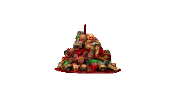
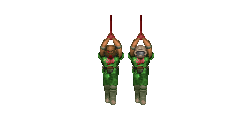
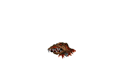

####Prop Stop: Gore & Corpses
|ID|Name|Preview|Comment|
|---|---|---|---|
|[353](https://github.com/alexey-lysiuk/Realm667-AAA-Cache/raw/master/data/0353.zip)|Bloody Chain (PSX Doom)|||
|[365](https://github.com/alexey-lysiuk/Realm667-AAA-Cache/raw/master/data/0365.zip)|Bloody Heads|||
|[619](https://github.com/alexey-lysiuk/Realm667-AAA-Cache/raw/master/data/0619.zip)|Bone Pile|||
|[789](https://github.com/alexey-lysiuk/Realm667-AAA-Cache/raw/master/data/0789.zip)|Bound Marines|||
|[356](https://github.com/alexey-lysiuk/Realm667-AAA-Cache/raw/master/data/0356.zip)|Brown Scientist Carcass|||
|[643](https://github.com/alexey-lysiuk/Realm667-AAA-Cache/raw/master/data/0643.zip)|Burning Corpses|||
|[544](https://github.com/alexey-lysiuk/Realm667-AAA-Cache/raw/master/data/0544.zip)|Burning Corpse|||
|[918](https://github.com/alexey-lysiuk/Realm667-AAA-Cache/raw/master/data/0918.zip)|Corpse Pile|||
|[443](https://github.com/alexey-lysiuk/Realm667-AAA-Cache/raw/master/data/0443.zip)|Cow Skulls|||
|[545](https://github.com/alexey-lysiuk/Realm667-AAA-Cache/raw/master/data/0545.zip)|Crucified Corpses|||
|[519](https://github.com/alexey-lysiuk/Realm667-AAA-Cache/raw/master/data/0519.zip)|Cyberdemon Gore|||
|[530](https://github.com/alexey-lysiuk/Realm667-AAA-Cache/raw/master/data/0530.zip)|Daisy Scenes|||
|[595](https://github.com/alexey-lysiuk/Realm667-AAA-Cache/raw/master/data/0595.zip)|Dead Corvus|||
|[461](https://github.com/alexey-lysiuk/Realm667-AAA-Cache/raw/master/data/0461.zip)|Dead General|||
|[701](https://github.com/alexey-lysiuk/Realm667-AAA-Cache/raw/master/data/0701.zip)|Dead Scientists|||
|[350](https://github.com/alexey-lysiuk/Realm667-AAA-Cache/raw/master/data/0350.zip)|Demonic Arm|||
|[546](https://github.com/alexey-lysiuk/Realm667-AAA-Cache/raw/master/data/0546.zip)|Devilish Bust|||
|[854](https://github.com/alexey-lysiuk/Realm667-AAA-Cache/raw/master/data/0854.zip)|Gore Decorations|||
|[446](https://github.com/alexey-lysiuk/Realm667-AAA-Cache/raw/master/data/0446.zip)|Gore Pack|||
|[358](https://github.com/alexey-lysiuk/Realm667-AAA-Cache/raw/master/data/0358.zip)|Half Cut Soldier Carcass|||
|[464](https://github.com/alexey-lysiuk/Realm667-AAA-Cache/raw/master/data/0464.zip)|Hanged Bloody Skeleton|||
|[359](https://github.com/alexey-lysiuk/Realm667-AAA-Cache/raw/master/data/0359.zip)|Hanged Imps|||
|[455](https://github.com/alexey-lysiuk/Realm667-AAA-Cache/raw/master/data/0455.zip)|Hanged Marines|||
|[431](https://github.com/alexey-lysiuk/Realm667-AAA-Cache/raw/master/data/0431.zip)|Hanged Player|||
|[584](https://github.com/alexey-lysiuk/Realm667-AAA-Cache/raw/master/data/0584.zip)|Hanging Corpse Pack|||
|[729](https://github.com/alexey-lysiuk/Realm667-AAA-Cache/raw/master/data/0729.zip)|Hanging Duke|||
|[785](https://github.com/alexey-lysiuk/Realm667-AAA-Cache/raw/master/data/0785.zip)|Hanging Marine Meat|||
|[531](https://github.com/alexey-lysiuk/Realm667-AAA-Cache/raw/master/data/0531.zip)|Hanging Marines|||
|[781](https://github.com/alexey-lysiuk/Realm667-AAA-Cache/raw/master/data/0781.zip)|Hanging Marines 2|||
|[919](https://github.com/alexey-lysiuk/Realm667-AAA-Cache/raw/master/data/0919.zip)|Hanging Wizard Corpse|||
|[360](https://github.com/alexey-lysiuk/Realm667-AAA-Cache/raw/master/data/0360.zip)|Head Sticks|||
|[366](https://github.com/alexey-lysiuk/Realm667-AAA-Cache/raw/master/data/0366.zip)|Imp Stick|||
|[547](https://github.com/alexey-lysiuk/Realm667-AAA-Cache/raw/master/data/0547.zip)|Impaled Corpses|||
|[906](https://github.com/alexey-lysiuk/Realm667-AAA-Cache/raw/master/data/0906.zip)|Impaled Dog Heads|||
|[504](https://github.com/alexey-lysiuk/Realm667-AAA-Cache/raw/master/data/0504.zip)|Impaled Marines|||
|[405](https://github.com/alexey-lysiuk/Realm667-AAA-Cache/raw/master/data/0405.zip)|Impaled Rocket Guy|||
|[822](https://github.com/alexey-lysiuk/Realm667-AAA-Cache/raw/master/data/0822.zip)|Impaled Scientists|||
|[441](https://github.com/alexey-lysiuk/Realm667-AAA-Cache/raw/master/data/0441.zip)|Marine Corpses|||
|[538](https://github.com/alexey-lysiuk/Realm667-AAA-Cache/raw/master/data/0538.zip)|Marine Victim|||
|[440](https://github.com/alexey-lysiuk/Realm667-AAA-Cache/raw/master/data/0440.zip)|Monster Head|||
|[681](https://github.com/alexey-lysiuk/Realm667-AAA-Cache/raw/master/data/0681.zip)|Radioactive Corpses|||
|[361](https://github.com/alexey-lysiuk/Realm667-AAA-Cache/raw/master/data/0361.zip)|Shirtless Beheaded Marine|||
|[362](https://github.com/alexey-lysiuk/Realm667-AAA-Cache/raw/master/data/0362.zip)|Shirtless Marine Carcass|||
|[818](https://github.com/alexey-lysiuk/Realm667-AAA-Cache/raw/master/data/0818.zip)|Shootable Impaled Humans|||
|[420](https://github.com/alexey-lysiuk/Realm667-AAA-Cache/raw/master/data/0420.zip)|Sitting Corpses|||
|[463](https://github.com/alexey-lysiuk/Realm667-AAA-Cache/raw/master/data/0463.zip)|Skeleton|||
|[564](https://github.com/alexey-lysiuk/Realm667-AAA-Cache/raw/master/data/0564.zip)|Skewered Corpses|||
|[786](https://github.com/alexey-lysiuk/Realm667-AAA-Cache/raw/master/data/0786.zip)|Skulltag Gore|||
|[525](https://github.com/alexey-lysiuk/Realm667-AAA-Cache/raw/master/data/0525.zip)|Torn Corpse|||
|[424](https://github.com/alexey-lysiuk/Realm667-AAA-Cache/raw/master/data/0424.zip)|Tortured Baron|||
|[548](https://github.com/alexey-lysiuk/Realm667-AAA-Cache/raw/master/data/0548.zip)|Upside Down Corpses|||
|[727](https://github.com/alexey-lysiuk/Realm667-AAA-Cache/raw/master/data/0727.zip)|Wolfenstein Gore|||

[Back to table of content](../readme.md)
