####Prop Stop: Hell & Magic
|ID|Name|Preview|Comment|
|---|---|---|---|
|[728](https://github.com/alexey-lysiuk/Realm667-AAA-Cache/raw/master/data/0728.zip)|Banners|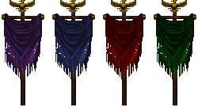||
|[345](https://github.com/alexey-lysiuk/Realm667-AAA-Cache/raw/master/data/0345.zip)|Bible|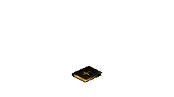||
|[346](https://github.com/alexey-lysiuk/Realm667-AAA-Cache/raw/master/data/0346.zip)|Bloody Chalice|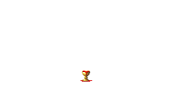||
|[677](https://github.com/alexey-lysiuk/Realm667-AAA-Cache/raw/master/data/0677.zip)|Ceramic Potery|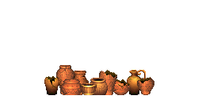||
|[959](https://github.com/alexey-lysiuk/Realm667-AAA-Cache/raw/master/data/0959.zip)|Chaos Sphere|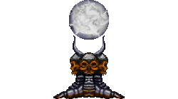||
|[882](https://github.com/alexey-lysiuk/Realm667-AAA-Cache/raw/master/data/0882.zip)|Crow|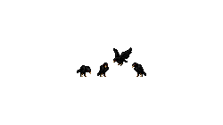||
|[616](https://github.com/alexey-lysiuk/Realm667-AAA-Cache/raw/master/data/0616.zip)|D'Sparil Statue|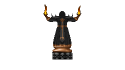||
|[583](https://github.com/alexey-lysiuk/Realm667-AAA-Cache/raw/master/data/0583.zip)|Doom Statues|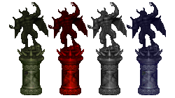||
|[462](https://github.com/alexey-lysiuk/Realm667-AAA-Cache/raw/master/data/0462.zip)|Evil Eye Variations|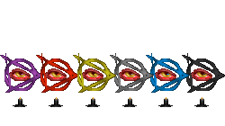||
|[734](https://github.com/alexey-lysiuk/Realm667-AAA-Cache/raw/master/data/0734.zip)|Fire Pillars (Doom)|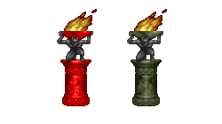||
|[735](https://github.com/alexey-lysiuk/Realm667-AAA-Cache/raw/master/data/0735.zip)|Fire Pillars (Hexen)|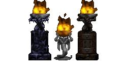||
|[645](https://github.com/alexey-lysiuk/Realm667-AAA-Cache/raw/master/data/0645.zip)|Flesh Pillar|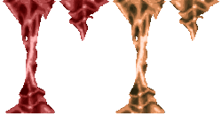||
|[905](https://github.com/alexey-lysiuk/Realm667-AAA-Cache/raw/master/data/0905.zip)|Flesh Pods|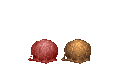||
|[617](https://github.com/alexey-lysiuk/Realm667-AAA-Cache/raw/master/data/0617.zip)|Gold Stand Gizmos|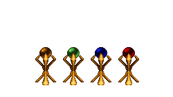||
|[474](https://github.com/alexey-lysiuk/Realm667-AAA-Cache/raw/master/data/0474.zip)|Hell Gizmos|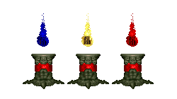||
|[418](https://github.com/alexey-lysiuk/Realm667-AAA-Cache/raw/master/data/0418.zip)|Hell Growth|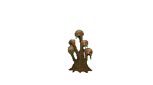||
|[660](https://github.com/alexey-lysiuk/Realm667-AAA-Cache/raw/master/data/0660.zip)|Hell Pillars|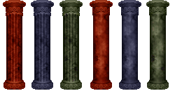||
|[475](https://github.com/alexey-lysiuk/Realm667-AAA-Cache/raw/master/data/0475.zip)|Heretic Gizmos|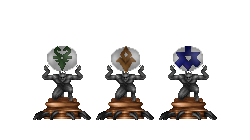||
|[698](https://github.com/alexey-lysiuk/Realm667-AAA-Cache/raw/master/data/0698.zip)|Marble Columns|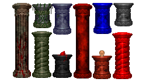||
|[883](https://github.com/alexey-lysiuk/Realm667-AAA-Cache/raw/master/data/0883.zip)|Marble Urn|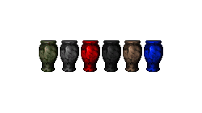||
|[833](https://github.com/alexey-lysiuk/Realm667-AAA-Cache/raw/master/data/0833.zip)|Necrodome Tombstones|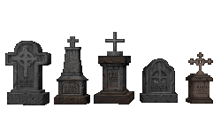||
|[737](https://github.com/alexey-lysiuk/Realm667-AAA-Cache/raw/master/data/0737.zip)|Pillar Gizmos|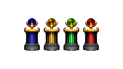||
|[856](https://github.com/alexey-lysiuk/Realm667-AAA-Cache/raw/master/data/0856.zip)|Rune Skull Pillars|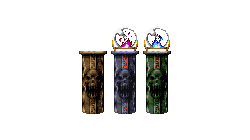||
|[651](https://github.com/alexey-lysiuk/Realm667-AAA-Cache/raw/master/data/0651.zip)|Skull Candle|||
|[872](https://github.com/alexey-lysiuk/Realm667-AAA-Cache/raw/master/data/0872.zip)|Small Key Gizmos|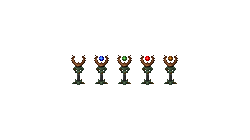||
|[680](https://github.com/alexey-lysiuk/Realm667-AAA-Cache/raw/master/data/0680.zip)|Stone Heads|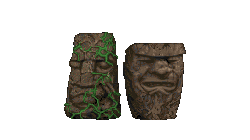||
|[702](https://github.com/alexey-lysiuk/Realm667-AAA-Cache/raw/master/data/0702.zip)|Strife Bloody Columns|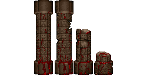||
|[354](https://github.com/alexey-lysiuk/Realm667-AAA-Cache/raw/master/data/0354.zip)|Tentacle Barrier|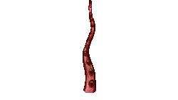||
|[861](https://github.com/alexey-lysiuk/Realm667-AAA-Cache/raw/master/data/0861.zip)|Warrior Statue|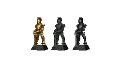||

[Back to table of content](../readme.md)
