####Prop Stop: Light Sources
|ID|Name|Preview|Comment|
|---|---|---|---|
|[819](https://github.com/alexey-lysiuk/Realm667-AAA-Cache/raw/master/data/0819.zip)|Black Torch|||
|[784](https://github.com/alexey-lysiuk/Realm667-AAA-Cache/raw/master/data/0784.zip)|Bronze Lamps|||
|[801](https://github.com/alexey-lysiuk/Realm667-AAA-Cache/raw/master/data/0801.zip)|Candle Color Variations|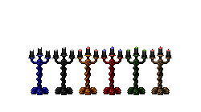||
|[586](https://github.com/alexey-lysiuk/Realm667-AAA-Cache/raw/master/data/0586.zip)|Ceiling Lamp|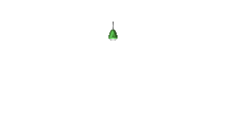||
|[517](https://github.com/alexey-lysiuk/Realm667-AAA-Cache/raw/master/data/0517.zip)|Chandelier Pack|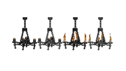||
|[715](https://github.com/alexey-lysiuk/Realm667-AAA-Cache/raw/master/data/0715.zip)|Doom64 Lamps|||
|[699](https://github.com/alexey-lysiuk/Realm667-AAA-Cache/raw/master/data/0699.zip)|Doom64 Torches|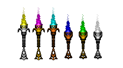||
|[871](https://github.com/alexey-lysiuk/Realm667-AAA-Cache/raw/master/data/0871.zip)|Fire Bowl|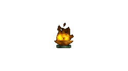||
|[820](https://github.com/alexey-lysiuk/Realm667-AAA-Cache/raw/master/data/0820.zip)|Firewood|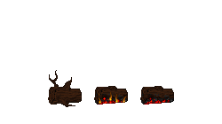||
|[821](https://github.com/alexey-lysiuk/Realm667-AAA-Cache/raw/master/data/0821.zip)|Golden Eagle Statue|||
|[357](https://github.com/alexey-lysiuk/Realm667-AAA-Cache/raw/master/data/0357.zip)|Grey Lamp|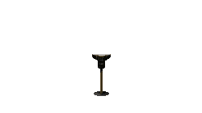||
|[549](https://github.com/alexey-lysiuk/Realm667-AAA-Cache/raw/master/data/0549.zip)|Lamps|||
|[611](https://github.com/alexey-lysiuk/Realm667-AAA-Cache/raw/master/data/0611.zip)|Lava Cauldron|||
|[647](https://github.com/alexey-lysiuk/Realm667-AAA-Cache/raw/master/data/0647.zip)|Light Column Variations|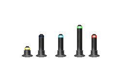||
|[920](https://github.com/alexey-lysiuk/Realm667-AAA-Cache/raw/master/data/0920.zip)|Marble Brazier|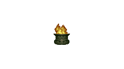||
|[563](https://github.com/alexey-lysiuk/Realm667-AAA-Cache/raw/master/data/0563.zip)|Roof Lights|||
|[614](https://github.com/alexey-lysiuk/Realm667-AAA-Cache/raw/master/data/0614.zip)|Serpent Braziers|||
|[398](https://github.com/alexey-lysiuk/Realm667-AAA-Cache/raw/master/data/0398.zip)|Skull Lamp|||
|[615](https://github.com/alexey-lysiuk/Realm667-AAA-Cache/raw/master/data/0615.zip)|Stone Torch|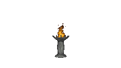||
|[887](https://github.com/alexey-lysiuk/Realm667-AAA-Cache/raw/master/data/0887.zip)|Strife Columns|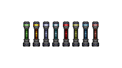||
|[716](https://github.com/alexey-lysiuk/Realm667-AAA-Cache/raw/master/data/0716.zip)|Strobe Lights|||
|[459](https://github.com/alexey-lysiuk/Realm667-AAA-Cache/raw/master/data/0459.zip)|Torch Variations|||
|[700](https://github.com/alexey-lysiuk/Realm667-AAA-Cache/raw/master/data/0700.zip)|Doom Wall Torches|||
|[363](https://github.com/alexey-lysiuk/Realm667-AAA-Cache/raw/master/data/0363.zip)|Yellow Lamp|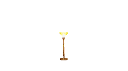||

[Back to table of content](../readme.md)
