####Prop Stop: Vegetation
|ID|Name|Preview|Comment|
|---|---|---|---|
|[917](../data/0917.zip)|Bushes|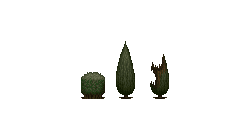||
|[676](../data/0676.zip)|Cacti|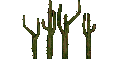||
|[644](../data/0644.zip)|Cactus|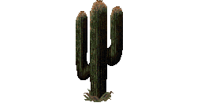||
|[832](../data/0832.zip)|Dead/Swamp Trees|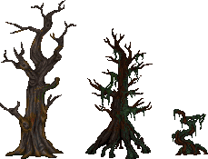||
|[672](../data/0672.zip)|Garden Trees|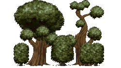||
|[627](../data/0627.zip)|Glowing Mushrooms|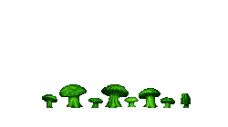||
|[792](../data/0792.zip)|Hell Trees|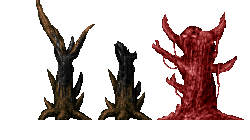||
|[610](../data/0610.zip)|Ice Stalagmites|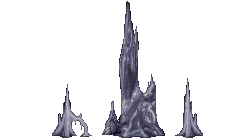||
|[632](../data/0632.zip)|Limestone Cave Formations|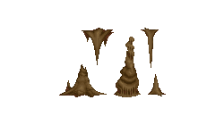||
|[649](../data/0649.zip)|Liquid Fountains|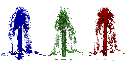||
|[613](../data/0613.zip)|Mushrooms|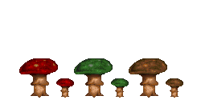||
|[771](../data/0771.zip)|Necrodome Rocks|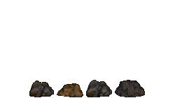||
|[678](../data/0678.zip)|Palm Trees|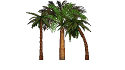||
|[797](../data/0797.zip)|Palm Trees (burnt)|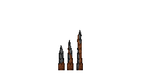||
|[466](../data/0466.zip)|Phobos Rocks|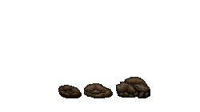||
|[587](../data/0587.zip)|Root Pack|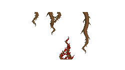||
|[624](../data/0624.zip)|Seaweed|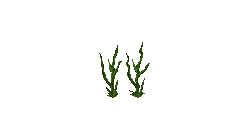||
|[527](../data/0527.zip)|Skull Tree|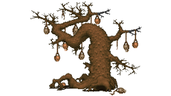||
|[679](../data/0679.zip)|Small Trees and Bushes|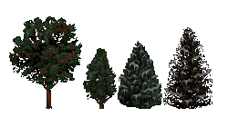||
|[528](../data/0528.zip)|Stalagmites and Stalactite|||
|[562](../data/0562.zip)|Winter Tree Spawner|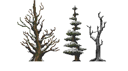||

[Back to table of content](../readme.md)
