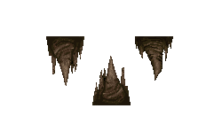

####Prop Stop: Vegetation
|ID|Name|Preview|Comment|
|---|---|---|---|
|[917](https://github.com/alexey-lysiuk/Realm667-AAA-Cache/raw/master/data/0917.zip)|Bushes|||
|[676](https://github.com/alexey-lysiuk/Realm667-AAA-Cache/raw/master/data/0676.zip)|Cacti|||
|[644](https://github.com/alexey-lysiuk/Realm667-AAA-Cache/raw/master/data/0644.zip)|Cactus|||
|[832](https://github.com/alexey-lysiuk/Realm667-AAA-Cache/raw/master/data/0832.zip)|Dead/Swamp Trees|||
|[672](https://github.com/alexey-lysiuk/Realm667-AAA-Cache/raw/master/data/0672.zip)|Garden Trees|||
|[627](https://github.com/alexey-lysiuk/Realm667-AAA-Cache/raw/master/data/0627.zip)|Glowing Mushrooms|||
|[792](https://github.com/alexey-lysiuk/Realm667-AAA-Cache/raw/master/data/0792.zip)|Hell Trees|||
|[610](https://github.com/alexey-lysiuk/Realm667-AAA-Cache/raw/master/data/0610.zip)|Ice Stalagmites|||
|[632](https://github.com/alexey-lysiuk/Realm667-AAA-Cache/raw/master/data/0632.zip)|Limestone Cave Formations|||
|[649](https://github.com/alexey-lysiuk/Realm667-AAA-Cache/raw/master/data/0649.zip)|Liquid Fountains|||
|[613](https://github.com/alexey-lysiuk/Realm667-AAA-Cache/raw/master/data/0613.zip)|Mushrooms|||
|[771](https://github.com/alexey-lysiuk/Realm667-AAA-Cache/raw/master/data/0771.zip)|Necrodome Rocks|||
|[678](https://github.com/alexey-lysiuk/Realm667-AAA-Cache/raw/master/data/0678.zip)|Palm Trees|||
|[797](https://github.com/alexey-lysiuk/Realm667-AAA-Cache/raw/master/data/0797.zip)|Palm Trees (burnt)|||
|[466](https://github.com/alexey-lysiuk/Realm667-AAA-Cache/raw/master/data/0466.zip)|Phobos Rocks|||
|[587](https://github.com/alexey-lysiuk/Realm667-AAA-Cache/raw/master/data/0587.zip)|Root Pack|||
|[624](https://github.com/alexey-lysiuk/Realm667-AAA-Cache/raw/master/data/0624.zip)|Seaweed|||
|[527](https://github.com/alexey-lysiuk/Realm667-AAA-Cache/raw/master/data/0527.zip)|Skull Tree|||
|[679](https://github.com/alexey-lysiuk/Realm667-AAA-Cache/raw/master/data/0679.zip)|Small Trees and Bushes|||
|[528](https://github.com/alexey-lysiuk/Realm667-AAA-Cache/raw/master/data/0528.zip)|Stalagmites and Stalactite|||
|[562](https://github.com/alexey-lysiuk/Realm667-AAA-Cache/raw/master/data/0562.zip)|Winter Tree Spawner|||

[Back to table of content](../readme.md)
