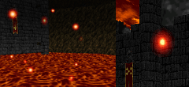
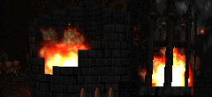
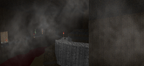
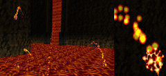
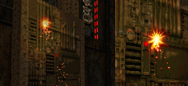
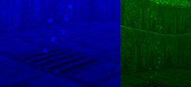

####SFX Shoppe: Elemental Effects
|ID|Name|Preview|Comment|
|---|---|---|---|
|[335](https://github.com/alexey-lysiuk/Realm667-AAA-Cache/raw/master/data/0335.zip)|Bubble Boiling|||
|[306](https://github.com/alexey-lysiuk/Realm667-AAA-Cache/raw/master/data/0306.zip)|Clouds|||
|~~[847](https://github.com/alexey-lysiuk/Realm667-AAA-Cache/raw/master/data/0847.zip)~~|~~Doom Terrain Splashes~~||Excluded from generated package|
|[278](https://github.com/alexey-lysiuk/Realm667-AAA-Cache/raw/master/data/0278.zip)|Ember|||
|[280](https://github.com/alexey-lysiuk/Realm667-AAA-Cache/raw/master/data/0280.zip)|Fire|||
|[791](https://github.com/alexey-lysiuk/Realm667-AAA-Cache/raw/master/data/0791.zip)|Fog|||
|[708](https://github.com/alexey-lysiuk/Realm667-AAA-Cache/raw/master/data/0708.zip)|Lavaball|||
|[279](https://github.com/alexey-lysiuk/Realm667-AAA-Cache/raw/master/data/0279.zip)|Sparks|||
|[276](https://github.com/alexey-lysiuk/Realm667-AAA-Cache/raw/master/data/0276.zip)|Steam|||
|[303](https://github.com/alexey-lysiuk/Realm667-AAA-Cache/raw/master/data/0303.zip)|Thunder FX|||
|[665](https://github.com/alexey-lysiuk/Realm667-AAA-Cache/raw/master/data/0665.zip)|Thunder Portal|||
|[904](https://github.com/alexey-lysiuk/Realm667-AAA-Cache/raw/master/data/0904.zip)|Toxic Clouds|||
|[667](https://github.com/alexey-lysiuk/Realm667-AAA-Cache/raw/master/data/0667.zip)|Underwater Bubbles|||

[Back to table of content](../readme.md)
