####SFX Shoppe: Particle Spawners
|ID|Name|Preview|Comment|
|---|---|---|---|
|[668](https://github.com/alexey-lysiuk/Realm667-AAA-Cache/raw/master/data/0668.zip)|Casing Spawners|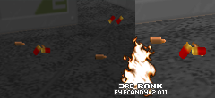||
|[662](https://github.com/alexey-lysiuk/Realm667-AAA-Cache/raw/master/data/0662.zip)|Forcefield Laserbeams|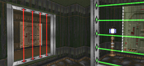||
|[925](https://github.com/alexey-lysiuk/Realm667-AAA-Cache/raw/master/data/0925.zip)|Fountain of Rejuvenation|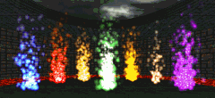||
|[664](https://github.com/alexey-lysiuk/Realm667-AAA-Cache/raw/master/data/0664.zip)|Magic Sparkle|||
|[889](https://github.com/alexey-lysiuk/Realm667-AAA-Cache/raw/master/data/0889.zip)|Pond Frogs|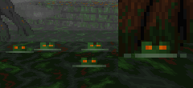||
|[663](https://github.com/alexey-lysiuk/Realm667-AAA-Cache/raw/master/data/0663.zip)|PowerRing Pads|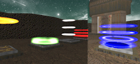||
|[703](https://github.com/alexey-lysiuk/Realm667-AAA-Cache/raw/master/data/0703.zip)|Scurrying Rats|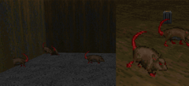||
|[721](https://github.com/alexey-lysiuk/Realm667-AAA-Cache/raw/master/data/0721.zip)|Soul Spawners|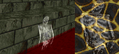||
|[277](https://github.com/alexey-lysiuk/Realm667-AAA-Cache/raw/master/data/0277.zip)|Sparkle Spawners|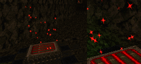||
|[197](https://github.com/alexey-lysiuk/Realm667-AAA-Cache/raw/master/data/0197.zip)|Stronghold PowerPad|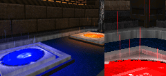||
|[799](https://github.com/alexey-lysiuk/Realm667-AAA-Cache/raw/master/data/0799.zip)|Swarm Spawner|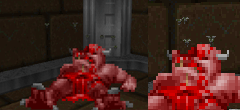||
|[870](https://github.com/alexey-lysiuk/Realm667-AAA-Cache/raw/master/data/0870.zip)|Teleport Smoke Spawner|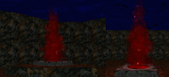||

[Back to table of content](../readme.md)
